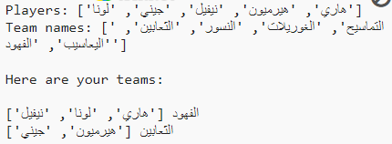

## مقدمة

في هذا المشروع ، ستتعلم كيفية إنشاء فريقين عشوائيين من قائمة لاعبين.

  <iframe src="https://trinket.io/embed/python/09f9687d09?outputOnly=true&start=result" width="600" height="500" frameborder="0" marginwidth="0" marginheight="0" allowfullscreen>
  </iframe>
  

### معلومات إضافية لقادة النادي

إذا كنت بحاجة إلى طباعة هذا المشروع، فيُرجى استخدام [النسخة القابلة للطباعة](https://projects.raspberrypi.org/ar-SA/projects/team-chooser/print).

--- collapse ---
---
title: ملاحظات قادة الناديملاحظات لقادة النادي
---
## مقدمة:

في هذا المشروع، سيتعلم الأطفال كيف ينشئون برنامجًا لتقسيم قائمة من اللاعبِين إلى فريقَين عشوائيين. هذا المشروع يعلم القوائم واستخدام الملفات.

## الموارد المتوفرة على الإنترنت

يستخدم هذا المشروع Python 3. نوصي باستخدام [trinket](https://trinket.io/) لكتابة Python على الإنترنت. يحتوي هذا المشروع على Trinket التالية:

* [جديد (فارغ) Python Trinket -- jumpto.cc/python-new](http://jumpto.cc/python-new)

وهناك أيضًا trinket تحتوي على المشروع المكتمل:

* [مشروع 'برنامج اختيار الفِرق' مُكتمل -- trinket.io/python/09f9687d09](https://trinket.io/python/09f9687d09)

## الموارد المتوفرة دون اتصال بالإنترنت

يمكن إكمال هذا المشروع [ دون اتصال بالإنترنت](https://www.codeclubprojects.org/en-GB/resources/python-working-offline/) إذا كنت تفضل ذلك. يمكنك الوصول إلى موارد المشروع من خلال النقر فوق رابط "مواد المشروع" الخاص بهذا المشروع. يحتوي هذا الرابط على قسم "موارد المشروع"، الذي يتضمن الموارد التي يحتاج إليها الأطفال لإكمال هذا المشروع من دون اتصال بالإنترنت. تأكد من أن كل طفل لديه إمكانية الوصول إلى نسخة من هذه الموارد. يتضمن هذا القسم الملفات التالية:

* team/team.py

يمكنك أيضًا العثور على نسخة مكتملة من هذا المشروع في قسم "موارد المتطوعين" ، والذي يحتوي على:

* team-finished/team.py

(جميع الموارد المذكورة أعلاه قابلة للتنزيل أيضًا كملفات `.zip` للمشاريع والمتطوعين)

## أهداف التعلم

* القوائم;
* تحميل بيانات قائمة من ملف.

يتناول هذا المشروع عناصر من الصفوف التالية من المناهج الرقمية الخاصة بـ [Raspberry Pi](https://rpf.io/curriculum):

* [استخدام تراكيب البرمجة الأساسية لإنشاء برامج بسيطة.](https://www.raspberrypi.org/curriculum/programming/creator)

## تحديات

* "أضف لاعبِين آخرين" - إضافة عناصر إلى قائمة `players`؛
* "اختر لاعبِين للفريق B" - إنشاء قائمة `teamB` جديدة لإضافة لاعبِين عشوائيين إليها؛
* "أسماء عشوائية للفِرق" - إنشاء قائمة `teamNames` جديدة واستخدامها لتعيين أسماء عشوائية إلى الفِرق؛
* "خزِّن أسماء الفِرق " - تخزين أسماء الفِرق في ملف وتحميلها إلى متغير `teamNames`؛
* "المزيد من الفرق" - تقسيم اللاعبين إلى 3 فرق بدلاً من فريقين.

--- /collapse ---

--- collapse ---
---
title: مواد المشروع
---
## موارد المشروع

* يمكنك [الحصول على الموارد لهذا المشروع هنا](https://rpf.io/p/ar-SA/team-chooser-go).
* [Python Trinket فارغة على الانترنت](http://jumpto.cc/python-new)
* [ملف Python فارغ بدون الاتصال بالانترنت](resources/new-new.py)

## موارد قادة النادي

* يمكنك [ العثور على الحلول لهذا المشروع هنا ](https://rpf.io/p/ar-SA/team-chooser-get){:target="_blank"}.
* [مشروع Trinket مكتمل على الإنترنت](https://trinket.io/python/09f9687d09)
* [team-chooser-finished/team-chooser.py](resources/team-chooser-finished-team-chooser.py)

--- /collapse ---