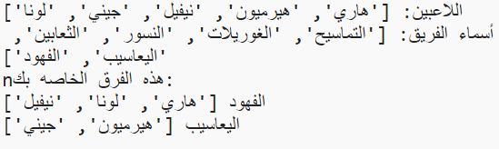

## المقدمة:

في هذا المشروع ، ستتعلم كيفية إنشاء فريقين عشوائيين من قائمة اللاعبين.

  <iframe src="https://trinket.io/embed/python/a699c44ce6?outputOnly=true&start=result" width="600" height="500" frameborder="0" marginwidth="0" marginheight="0" allowfullscreen>
  </iframe>
  

### معلومات إضافية لقادة النادي

إذا كنت بحاجة إلى طباعة هذا المشروع، فيُرجى استخدام [النسخة القابلة للطباعة](https://projects.raspberrypi.org/en/projects/team-chooser/print).

## \--- collapse \---

## title: ملاحظات قادة النادي

## مقدمة:

في هذا المشروع ، سيتعلم الأطفال كيفية إنشاء برنامج لتقسيم قائمة اللاعبين إلى فريقين عشوائيين. هذا المشروع يعلم القوائم واستخدام الملفات.

## الموارد على الإنترنت

** يستخدم هذا المشروع Python 3. ** نوصي باستخدام [حلية](https://trinket.io/) لكتابة بايثون على الانترنت. يحتوي هذا المشروع على Trinkets التالي:

* [جديد (فارغ) Python Trinket -- jumpto.cc/python-new](http://jumpto.cc/python-new)

هناك أيضًا trinket تحتوي على المشروع المكتمل:

* ["منتقي الفريق" انتهى - trinket.io/python/a699c44ce6](https://trinket.io/python/a699c44ce6)

## الموارد دون اتصال

يمكن أن يكون هذا المشروع [مكتمل في وضع عدم الاتصال](https://www.codeclubprojects.org/en-GB/resources/python-working-offline/) إذا فضلت. يمكنك الوصول إلى موارد المشروع بالنقر فوق ارتباط "مواد المشروع" لهذا المشروع. يحتوي هذا الرابط على قسم "موارد المشروع" ، والذي يتضمن الموارد التي يحتاجها الأطفال لإكمال هذا المشروع دون اتصال. تأكد من أن كل طفل لديه حق الوصول إلى نسخة من هذه الموارد. يتضمن هذا القسم الملفات التالية:

* team/team.py

يمكنك أيضًا العثور على نسخة مكتملة من هذا المشروع في قسم "موارد المتطوعين" ، والذي يحتوي على:

* team-finished/team.py

(جميع الموارد المذكورة أعلاه قابلة للتنزيل أيضًا كمشروع وتطوع `.zip` الملفات.)

## أهداف التعلم

* القوائم;
* تحميل بيانات القائمة من ملف.

يتناول هذا المشروع عناصر من معايير المناهج الرقمية الخاصة بـ [Raspberry Pi](http://rpf.io/curriculum):

* [استخدام تراكيب البرمجة الأساسية لإنشاء برامج بسيطة.](https://www.raspberrypi.org/curriculum/programming/creator)

## التحديات

* "إضافة المزيد من اللاعبين" - إضافة عناصر إلى `لاعبين` قائمة؛;
* "اختيار الفريق B" - إنشاء فريق جديد `teamB` قائمة لإضافة لاعبين عشوائيين إلى ؛;
* "أسماء الفرق العشوائية" - إنشاء واستخدام `teamNames` قائمة لتعيين أسماء عشوائية للفرق ؛;
* "تخزين أسماء الفرق" - تخزين أسماء الفرق في ملف وتحميلها الى `teamNames` متغير؛;
* "المزيد من الفرق" - تقسيم اللاعبين إلى 3 فرق بدلاً من 2.

\--- /collapse \---

## \--- collapse \---

## title: مواد المشروع

## موارد المشروع

* [ملف.zip يحتوي على جميع موارد المشروع](resources/team-chooser-project-resources.zip)
* [على الانترنت فارغة بيثون حلية](http://jumpto.cc/python-new)
* [غير متصل ملف بايثون فارغة](resources/new-new.py)

## موارد قادة النادي

* [ملف.zip يحتوي على جميع موارد المشروع المكتملة](resources/team-chooser-volunteer-resources.zip)
* [عبر الإنترنت الانتهاء من مشروع Trinket](https://trinket.io/python/a699c44ce6)
* [team-chooser-finished/team-chooser.py](resources/team-chooser-finished-team-chooser.py)

\--- /collapse \---