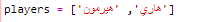
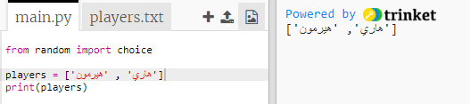
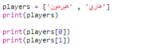

## لاعبين

لنبدأ بإنشاء قائمة من اللاعبين للاختيار من بينها.

+ افتح trinket يحتوي على قالب Python فارغ:<a href="http://jumpto.cc/python-new" target="_blank">jumpto.cc/python-new</a>.

+ يمكنك استخدام متغير لتخزين قائمة **** من اللاعبين. يجب أن تكون القائمة بين أقواس مربعة `[]` ، مع فاصلة بين كل عنصر في القائمة.
    
    ابدأ بإضافة قائمة باللاعبين إلى برنامجك.
    
    

+ إضافة هذه التعليمة البرمجية لطباعة متغير `اللاعبين` الخاصة بك:
    
    

+ يمكنك الوصول إلى عنصر في القائمة بإضافة موضعه بين أقواس مربعة بعد اسم المتغير.
    
    العنصر الأول في القائمة هو في **الموضع 0**. هذا يختلف عن سكراتش ، التي تبدأ في الموضع 1.
    
    