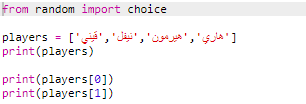
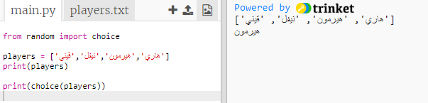
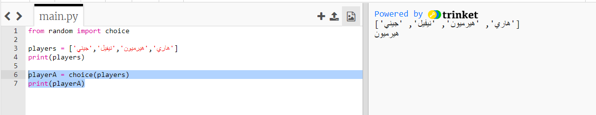
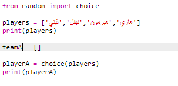
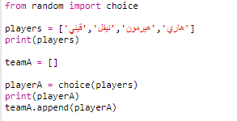
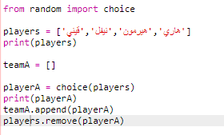
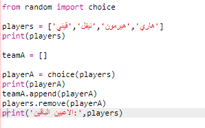

## لاعبين عشوائيين

دعونا نختار لاعبين عشوائيين!

+ لتكون قادرًا على الحصول على لاعب عشوائي من لاعبي `` أولاً ، ستحتاج إلى استيراد الخيار `` جزء من ` عشوائي ` وحدة.
    
    

+ للحصول على لاعب عشوائي, يمكنك استخدام `خيار`. (يمكنك أيضا حذف التعليمات البرمجية لطباعة اللاعبين الفردية)
    
    

+ اختبار التعليمات البرمجية الخاصة بك `اختيار` بضع مرات، ويجب أن نرى لاعب مختلفة يتم اختيارها في كل مرة.

+ يمكنك أيضًا إنشاء متغير جديد يسمى ` playerA ` ، واستخدامها لتخزين لاعب عشوائي.
    
    

+ ستحتاج إلى قائمة جديدة لتخزين جميع اللاعبين في الفريق A. للبدء ، يجب أن تكون هذه القائمة فارغة.
    
    

+ يمكنك الآن إضافة الاعب المختار عشوائياً إلى ` teamA `. للقيام بذلك ، يمكنك استخدام ` teamA.append ` (** إلحاقي ** يعني إضافة إلى النهاية).
    
    

+ الآن بعد أن تم اختيار اللاعب الخاص بك ، يمكنك إزالته من قائمة اللاعبين ` الخاصة بك `.
    
    

+ اختبر هذا الرمز عن طريق إضافة ` طباعة ` الأمر ، لإظهار اللاعبين `` اليسار للاختيار من بينها.
    
    
    
    في المثال أعلاه ، تم اختيار Hermione لـ ` teamA ` ، وهكذا تمت إزالته من قائمة اللاعبين ``.