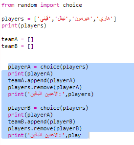
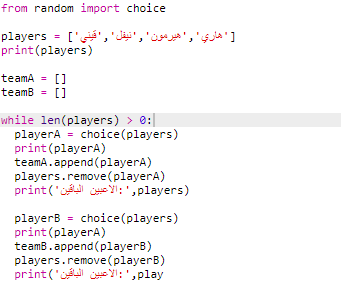
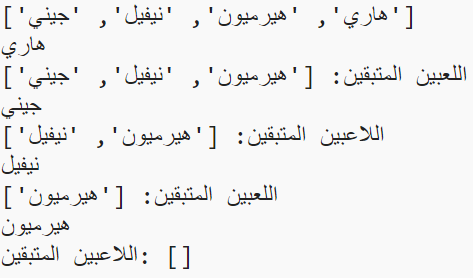
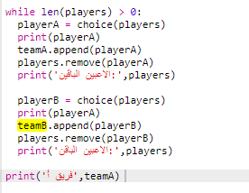
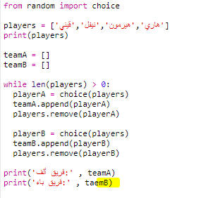
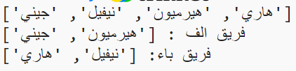

## اختيار الكثير من اللاعبين

بعد ذلك ستحتاج إلى التأكد من اختيار كل لاعب لفريق.

+ حدد رمزك لاختيار اللاعبين للفريق A والفريق B واضغط على مفتاح tab لإضافة مسافة بادئة للرمز.
    
    

+ أضف ** بينما ** حلقة للحفاظ على اختيار اللاعبين حتى طول اللاعبين ` ` القائمة هي 0.
    
    

+ شغِّل شفرتك لاختبارها. يجب أن تشاهد لاعبين يتم اختيارهم للفريق A والفريق B حتى لا يتبقى المزيد من اللاعبين.
    
    

+ أضف رمزًا لطباعة ` teamA ` قائمة ** بعد ** الخاص بك ` بينما ` حلقة (التأكد من أنه لم يتم وضع مسافة بادئة له).
    
    هذا يعني أن ` teamA ` سيتم طباعتها مرة واحدة فقط ، بعد اختيار جميع اللاعبين.
    
    

+ يمكنك القيام بنفس الشيء لـ ` teamB ` ويمكنك أيضًا حذف أوامر الطباعة الأخرى ، لأنها كانت موجودة فقط لاختبار شفرتك.
    
    إليك كيفية ظهور شفرتك:
    
    

+ اختبر شفرتك مرة أخرى ويجب أن ترى قائمة اللاعبين بالإضافة إلى فرقك النهائية.
    
    