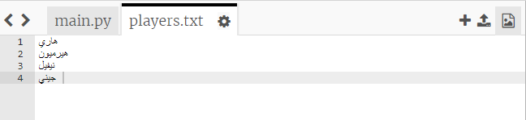
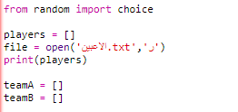
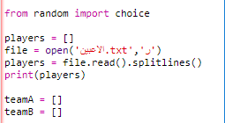

## الملفات

يمكنك استخدام ملف لتخزين قائمة اللاعبِين.

+ انقر فوق الرمز + وأنشئ ملفًا جديدًا يُسمى `players.txt`.

	

+ أضف اللاعبِين إلى الملف الجديد. وتأكد من عدم وجود سطر فارغ بعد اللاعب الأخير في الملف.

	

+ غيِّر القائمة `players` بحيث تكون فارغة.

	

+ افتح الملف `players.txt` (الأمر `'r'` يعني القراءة فقط).

	

+ اقرأ القائمة من الملف وأضفها إلى القائمة `players`. (وتعني التعليمة البرمجية `splitlines` أن كل سطر في الملف هو عنصر جديد في القائمة `players`).

	

+ إذا اختبرتَ تعليماتك البرمجية، فستعمل بشكل صحيح كما سبق تمامًا. ومن ناحية أخرى، ستكون إضافة اللاعبِين إلى الملف `players.txt` أسهل بكثير.

