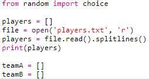

## الملفات

يمكنك استخدام ملف لتخزين قائمة من اللاعبين.

+ انقر فوق الرمز + وإنشاء ملف جديد سمه `players.txt`.
    
    

+ أضف لاعبيك إلى ملفك الجديد. تأكد من عدم وجود سطر فارغ بعد آخر لاعب.
    
    

+ غير قائمة `اللاعبين (players)` الخاصة بك بحيث تكون فارغة.
    
    

+ افتح ملف ` players.txt الخاص بك`(`"R"` يعني للقراءة فقط).
    
    

+ اقرأ القائمة من الملف وأضفها إلى قائمة `اللاعبين` الخاصة بك. (كود ال`splitlines` يعني ان كل سطر في الملف هو عنصر جديد في قائمة `اللاعبين`).
    
    

+ إذا قمت باختبار التعليمات البرمجية الخاصة بك، فإنها تنبغي أن تعمل بالضبط كما عملت قبل. ومع ذلك، الآن أسهل بكثير إضافة لاعبين إلى ملف `players.txt`.