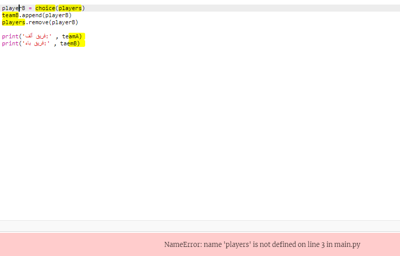
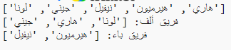

## لاعبين فرديين

دعونا نحسن برنامجك للعمل مع عدد فردي من اللاعبين.

+ أضف اسمًا آخر إلى ** players.txt الخاص بك </code> قائمة ، بحيث يكون لديك عدد فردي من اللاعبين.
 
    
    </li> 
    
    + إذا اختبرت شفرتك ، فسترى أنك تتلقى رسالة خطأ.
        
        
    
    + الخطأ هو أن برنامجك يواصل اختيار اللاعبين العشوائيين للفريق A ثم الفريق B. ومع ذلك ، إذا كان هناك عدد فردي من اللاعبين ، فبعد اختيار لاعب للفريق A لن يكون هناك لاعبون يتم اختيارهم للاختيار من بين الفريق B.
        
        لإصلاح هذا الخطأ ، يمكنك إخبار البرنامج بـ ` فاصل ` للخروج من ` بينما ` حلقة إذا كان لديك ` لاعبين ` القائمة فارغة.
        
        
    
    + إذا قمت باختبار التعليمات البرمجية مرة أخرى ، يجب أن تشاهد أنها تعمل الآن مع عدد فردي من اللاعبين.
        
        </ul>