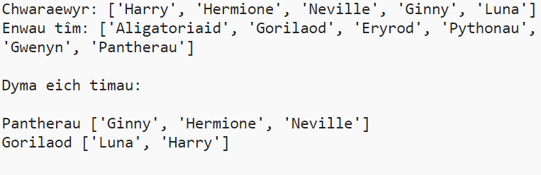

## Cyflwyniad:

Yn y prosiect hwn, byddwch chi'n dysgu sut i greu 2 dîm ar hap o restr o chwaraewyr.

  <iframe src="https://trinket.io/embed/python/a699c44ce6?outputOnly=true&start=result" width="600" height="500" frameborder="0" marginwidth="0" marginheight="0" allowfullscreen>
  </iframe>
  

### Gwybodaeth ychwanegol ar gyfer arweinwyr clwb

Os oes angen i chi argraffu'r prosiect hwn, defnyddiwch y fersiwn [hwylus i'w argraffu](https://projects.raspberrypi.org/en/projects/team-chooser/print).

## \--- collapse \---

## title: Nodiadau arweinwyr clwb

## Cyflwyniad:

Yn y prosiect hwn, bydd plant yn dysgu sut i wneud rhaglen i rannu rhestr o chwaraewyr yn 2 dîm ar hap. Mae'r prosiect hwn yn dysgu rhestrau a defnyddio ffeiliau.

## Adnoddau Ar-lein

**Mae'r prosiect hwn yn defnyddio Python 3.** Rydym yn argymell defnyddio [trinket](https://trinket.io/) i ysgrifennu Python ar-lein. Mae'r prosiect hwn yn cynnwys y Trinkets canlynol:

* [Python Trinket newydd (gwag) - jumpto.cc/python-new](http://jumpto.cc/python-new)

Mae trinket hefyd yn cynnwys y prosiect a gwblhawyd:

* ['Dewisydd Tîm' wedi'i gwblhau - trinket.io/python/a699c44ce6](https://trinket.io/python/a699c44ce6)

## Adnoddau All-lein

Gall y prosiect hwn gael ei [gwblhau all-lein](https://www.codeclubprojects.org/en-GB/resources/python-working-offline/) os yw'n well gennych. Gallwch chi gael mynediad at adnoddau'r prosiect trwy glicio ar y ddolen 'Deunyddiau Prosiect' ar gyfer y prosiect hwn. Mae'r ddolen hon yn cynnwys adran 'Adnoddau Prosiect', sy'n cynnwys adnoddau y bydd eu hangen ar blant i gwblhau'r prosiect hwn all-lein. Sicrhewch fod gan bob plentyn fynediad at gopi o'r adnoddau hyn. Mae'r adran hon yn cynnwys y ffeiliau canlynol:

* team/team.py

Gallwch hefyd ddod o hyd i fersiwn wedi'i gwblhau o'r prosiect hwn yn yr adran 'Adnoddau Gwirfoddolwyr', sy'n cynnwys:

* team-finished/team.py

(Mae'r holl adnoddau uchod hefyd yn lawrlwythadwy fel prosiect a ffeiliau `.zip` gwirfoddolwyr.)

## Amcanion Dysgu

* Rhestrau;
* Llwytho data rhestr o ffeil.

Mae’r prosiect hwn yn cwmpasu elfennau o’r ffrydiau canlynol o [Gwricwlwm Creu Digidol Raspberry Pi](http://rpf.io/curriculum):

* [Defnyddiwch lluniadau rhaglennu sylfaenol i greu rhaglenni syml.](https://www.raspberrypi.org/curriculum/programming/creator)

## Heriau

* 'Ychwanegu mwy o chwaraewyr' - ychwanegu elfennau i restr `chwaraewyr`;
* 'Dewis ar gyfer tîm B' - creu rhestr `tîmB` newydd i ychwanegu chwaraewyr ar hap at;
* 'Enwau tîm ar hap' - creu a defnyddio rhestr `Enwautîm` newydd i neilltuo enwau ar hap i dimau;
* 'Storio enwau tīm' - storio enwau tîm mewn ffeil, a'u llwytho i newidyn `Enwautîm` l;
* 'Mwy o dimau' - rhannu'r chwaraewyr i 3 thîm yn lle 2.

\--- /collapse \---

## \---collapse\---

## title: Deunyddiau prosiect

## Adnoddau'r prosiect

* [.zip ffeil sy'n cynnwys holl adnoddau'r prosiect](resources/team-chooser-project-resources.zip)
* [Trinket Python gwag ar-lein](http://jumpto.cc/python-new)
* [Ffurflen wag Python all-lein](resources/new-new.py)

## Adnoddau arweinwyr clwb

* [.zip sy'n cynnwys yr holl adnoddau prosiect cyflawn](resources/team-chooser-volunteer-resources.zip)
* [Prosiect Trinket wedi'i gwblhau ar-lein](https://trinket.io/python/a699c44ce6)
* [team-chooser-finished/team-chooser.py](resources/team-chooser-finished-team-chooser.py)

\--- /collapse \---