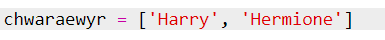
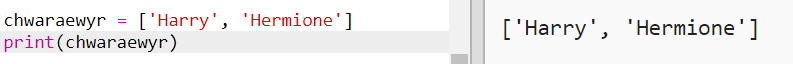
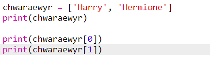

## Chwaraewyr

Gadewch i ni ddechrau trwy greu rhestr o chwaraewyr i ddewis o'u plith.

+ Agorwch y templed Python gwag Trinket: <a href="http://jumpto.cc/python-new" target="_blank">jumpto.cc/python-new</a>.

+ Gallwch ddefnyddio newidyn i storio **rhestr** o chwaraewyr. Dylai'r rhestr fod mewn cromfachau sgwâr `[]` , gyda choma rhwng pob eitem yn y rhestr.
    
    Dechreuwch wrth ychwanegu rhestr o chwaraewyr i'ch rhaglen.
    
    

+ Ychwanegwch y cod hwn i argraffu eich newidyn `chwaraewyr`:
    
    

+ Gallwch gyrraedd eitem yn y rhestr trwy ychwanegu ei lleoliad mewn cromfachau sgwâr ar ôl enw'r newidyn.
    
    Mae'r eitem gyntaf yn y rhestr yn **lleoliad 0**. Mae hyn yn wahanol i Scratch, sy'n dechrau yn lleoliad 1.
    
    