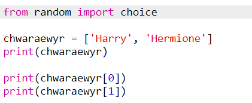
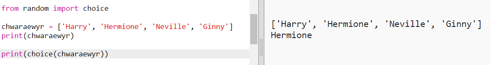
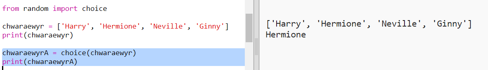
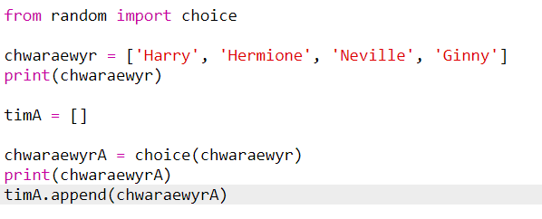
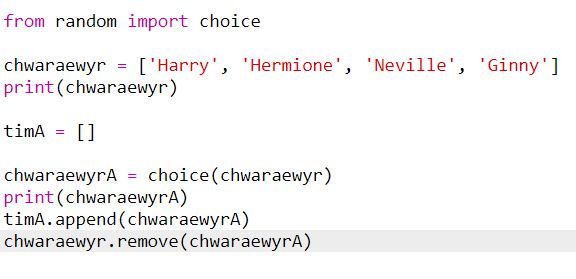

## Chwaraewyr ar hap

Gadewch i ni ddewis chwaraewyr ar hap!

+ I allu cael chwaraewr ar hap o'ch rhestr `chwaraewyr`, yn gyntaf bydd angen i chi fewnosod y rhan `choice` (dewis) o'r modiwl `random` (ar hap).
    
    

+ I gael chwaraewr ar hap, gallwch ddefnyddio `choice` (dewis). (Gallwch hefyd ddileu'r cod i argraffu chwaraewyr unigol.)
    
    

+ Profwch eich cod `choice` (dewis) ychydig o weithiau a dylech weld chwaraewr gwahanol yn cael ei ddewis bob tro.

+ Gallwch hefyd greu newidyn newydd o'r enw `chwaraewrA`, a'i ddefnyddio i storio eich chwaraewr ar hap.
    
    

+ Bydd angen rhestr newydd arnoch i storio pob un o'r chwaraewyr yn nhîm A. I ddechrau, dylai'r rhestr hon fod yn wag.
    
    

+ Nawr gallwch ychwanegu eich chwaraewr a ddewiswyd ar hap at `dîmA`. I wneud hyn, gallwch chi ddefnyddio `tîmA.append` (atodiad tîm A) mae (**atodiad** yn golygu ychwanegu at y diwedd).
    
    

+ Nawr mae eich chwaraewr wedi'i ddewis, gallwch ei dynnu oddi ar eich rhestr o `chwaraewyr`.
    
    

+ Profwch y cod hwn trwy ychwanegu gorchymyn `print` (argraffu), i ddangos y `chwaraewyr` sydd ar ôl i ddewis ohonynt.
    
    
    
    Yn yr enghraifft uchod, mae Hermione wedi'i dewis ar gyfer `tîmA`, ac felly mae hi wedi'i thynnu o'r rhestr o `chwaraewyr`.