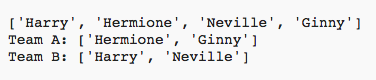

## Dewis llawer o chwaraewyr

Nesaf bydd angen i chi sicrhau bod pob chwaraewr wedi'i ddewis ar gyfer tîm.

+ Amlygwch eich cod ar gyfer dewis chwaraewyr ar gyfer tîm A a thîm B a gwasgu'r allwedd tab i fewnoli'r cod.
    
    

+ Ychwanegwch ddolen **while** (tra) i gadw dewis chwaraewyr nes bod hyd rhestr y `chwaraewyr` yn 0.
    
    

+ Rhedeg eich cod i'w brofi. Dylech weld y chwaraewyr yn cael eu dewis ar gyfer tîm A a thîm B nes nad oes rhagor o chwaraewyr ar ôl.
    
    

+ Ychwanegwch god i argraffu eich rhestr `tîmA` **ar ôl** eich dolen `while` (tra) (gan wneud yn siŵr nad yw wedi'i fewnoli).
    
    Mae hyn yn golygu bod `tîmA ` yn cael ei argraffu unwaith yn unig, ar ôl i'r holl chwaraewyr gael eu dewis.
    
    

+ Gallwch chi wneud yr un peth ar gyfer `tîmB`, a gallwch hefyd ddileu'r gorchmynion printio eraill, gan mai dim ond i brofi'ch cod roedden nhw yno.
    
    Dyma sut y dylai eich cod ymddangos:
    
    

+ Profwch eich cod eto a dylech weld eich rhestr o chwaraewyr yn ogystal â'ch timau terfynol.
    
    