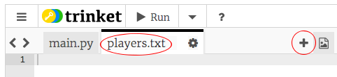

## Ffeiliau

Gallwch ddefnyddio ffeil i storio eich rhestr o chwaraewyr.

+ Cliciwch yr eicon + a chreu ffeil newydd o'r enw `chwaraewyr.txt`.
    
    

+ Ychwanegu eich chwaraewyr at eich ffeil newydd. Gwnewch yn siŵr nad oes llinell wag ar ôl eich chwaraewr olaf.
    
    

+ Newid eich rhestr `chwaraewyr` fel ei bod yn wag.
    
    

+ Agorwch eich ffeil `chwaraewyr.txt` (mae `'r'` yn golygu darllen yn unig).
    
    

+ Darllenwch y rhestr o'r ffeil a'i hychwanegu at eich rhestr `chwaraewyr`. (Mae'r Cod `splitlines` (llinellau hollt) yn golygu bod pob llinell yn y ffeil yn eitem newydd yn y rhestr `chwaraewyr`).
    
    

+ Os ydych chi'n profi eich cod, dylai weithio'n union yr un fath ag o'r blaen. Fodd bynnag, erbyn hyn mae'n llawer haws ychwanegu chwaraewyr at eich ffeil `chwaraewyr.txt`.