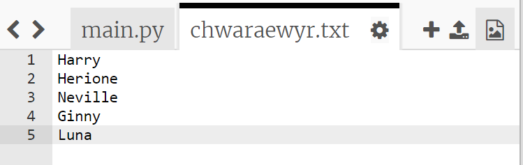
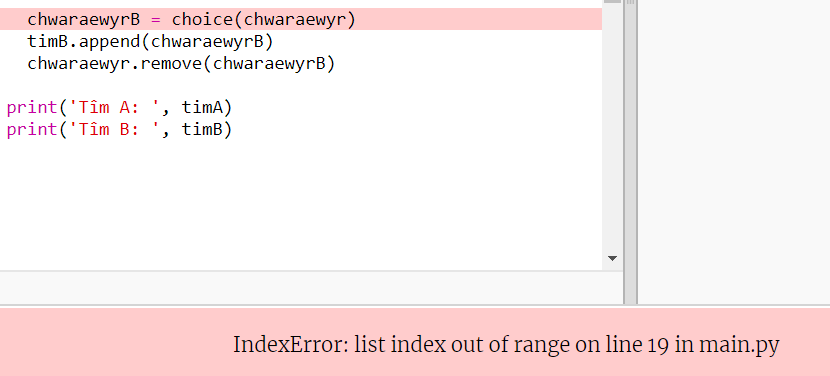
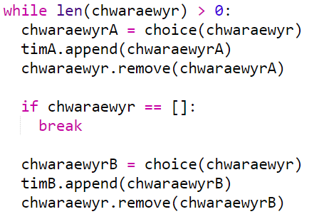
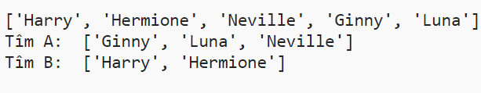

## Chwaraewyr odrif

Gadewch i ni wella eich rhaglen i weithio gyda nifer od o chwaraewyr.

+ Ychwanegwch enw arall at eich rhestr `chwaraewyr.txt`, fel bod gennych chi nifer od o chwaraewyr.
    
    

+ Os byddwch chi'n profi eich cod, fe welwch eich bod yn cael neges gwall.
    
    

+ Mae'r gwall oherwydd bod eich rhaglen yn parhau i ddewis chwaraewyr ar hap ar gyfer tîm A ac yna tîm B. Fodd bynnag, os oes nifer od o chwaraewyr yna ar ôl dewis chwaraewr ar gyfer tîm A does dim chwaraewyr ar ôl i'w dewis ar gyfer tîm B.
    
    I atgyweirio'r gwall hwn, gallwch chi ddweud wrth eich rhaglen i `break` (dorri) allan o'ch dolen `while` (tra) dolen os yw eich rhestr `chwaraewyr` yn wag.
    
    

+ Os ydych chi'n profi eich cod eto, dylech weld ei fod bellach yn gweithio gyda nifer od o chwaraewyr.
    
    