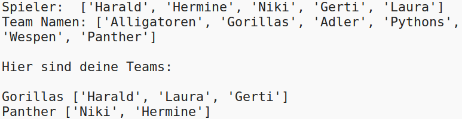

## Einleitung:

In diesem Projekt lernst du, wie du aus einer Liste von Spielern zwei zufällige Teams erstellst.

  <iframe src="https://trinket.io/embed/python/a699c44ce6?outputOnly=true&start=result" width="600" height="500" frameborder="0" marginwidth="0" marginheight="0" allowfullscreen>
  </iframe>
  

### Zusätzliche Information für Clubleiter

Falls Sie dieses Projekt ausdrucken müssen, verwenden Sie bitte die [druckfreundliche Version](https://projects.raspberrypi.org/en/projects/team-chooser/print).

## \--- collapse \---

## title: Anmerkungen für Clubleiter

## Einleitung:

In diesem Projekt lernen Kinder, ein Programm zu erstellen, um eine Liste von Spielern in zwei zufällige Teams aufzuteilen. Dieses Projekt vermittelt Listen und das Verwenden von Dateien.

## Online-Ressourcen

**Dieses Projekt verwendet Python 3.** Wir empfehlen die Verwendung von [trinket](https://trinket.io/), um Python-Programme online zu schreiben. Dieses Projekt enthält die folgenden Trinkets:

* [Neues (leeres) Python Trinket - jumpto.cc/python-new](http://jumpto.cc/python-new)

Außerdem ist ein trinket mit dem vollständigen Projekt verfügbar:

* ['Team Chooser' fertig gestellt - trinket.io/python/a699c44ce6](https://trinket.io/python/a699c44ce6)

## Offline-Ressourcen

Dieses Projekt kann, falls gewünscht, auch [offline bearbeitet](https://www.codeclubprojects.org/en-GB/resources/python-working-offline/) werden. Sie können auf die Projektressourcen zugreifen, indem Sie auf den Link "Projektmaterial" für dieses Projekt klicken. Dieser Link enthält einen Abschnitt "Projektressourcen" mit Ressourcen, die die Kinder benötigen, um das Projekt offline abschließen zu können. Stellen Sie sicher, dass jedes Kind Zugriff auf eine Kopie dieser Ressourcen hat. Dieser Abschnitt enthält die folgenden Dateien:

* team/team.py

Eine vollständige Version dieses Projekts finden Sie auch im Abschnitt "Ressourcen für Freiwillige Mitarbeiter" mit diesem Inhalt:

* team-finished/team.py

(Alle oben genannten Ressourcen können auch als `.zip`-Dateien für Projekte und für Freiwillige heruntergeladen werden.)

## Lernziele

* Listen (lists);
* Listendaten aus einer Datei laden.

Dieses Projekt umfasst Elemente aus den folgenden Zweigen des [Raspberry Pi Digital Making Curriculum](http://rpf.io/curriculum):

* [Verwendung grundlegender Programmierkonstrukte, um einfache Programme zu erstellen.](https://www.raspberrypi.org/curriculum/programming/creator)

## Aufgaben

* "Hinzufügen weiterer Spieler" - Hinzufügen von Elementen zu einer Liste mit `Spielern`;
* "Auswahl für Team B" - Erstellen eines neuen Liste `Team B ` um zufällige Spieler hinzuzufügen;
* "Zufällige Teamnamen" - Erstellen und Verwenden einer neuen Liste `teamNamen`, um den Teams beliebige Namen zuzuweisen;
* "Teamnamen speichern" - Speichern von Teamnamen in einer Datei und Laden dieser in eine Variable `teamNamen`;
* "Weitere Teams" - Aufteilung der Spieler in 3 Teams statt in 2 Teams.

\--- /collapse \---

## \--- collapse \---

## title: Projektmaterialien

## Projektressourcen

* [.zip-Datei mit allen Projektressourcen](resources/team-chooser-project-resources.zip)
* [leeres Python-Trinket - online](http://jumpto.cc/python-new)
* [leere Python-Datei - offline](resources/new-new.py)

## Ressourcen für Clubleiter

* [.zip-Datei mit allen fertig gestellten Projektressourcen](resources/team-chooser-volunteer-resources.zip)
* [Fertiges online Trinket-Projekt](https://trinket.io/python/a699c44ce6)
* [team-chooser-finished/team-chooser.py](resources/team-chooser-finished-team-chooser.py)

\--- /collapse \---