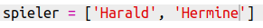
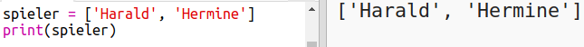

## Mitspieler

Beginnen wir mit dem Erstellen einer Liste von Spielern, aus denen du wählen kannst.

+ Öffne die leere Python-Trinket-Vorlage: <a href="http://jumpto.cc/python-new" target="_blank">jumpto.cc/python-new</a>.

+ Du kannst eine Variable verwenden, um eine **Liste** von Spielern zu speichern. Die Liste sollte in eckigen Klammern stehen. `[]` , mit einem Komma zwischen den Elementen in der Liste.
    
    Beginne, indem du deinem Programm eine Liste von Spielern hinzufügst.
    
    

+ Füge diesen Code hinzu, um deine Variable `spieler` auszugeben:
    
    

+ Du kannst zu einem Element in der Liste gelangen, indem du seine Position in eckigen Klammern nach dem Variablennamen hinzufügst.
    
    Der erste Eintrag in der Liste befindet sich an **Position 0**. Dies unterscheidet sich von Scratch, das mit Position 1 beginnt.
    
    