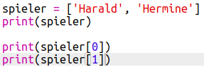

## Mitspieler

Lass uns beginnen, indem wir eine Liste von Mitspielern erstellen unter denen wir auswählen können.

+ Das leere Python Vorlage- Trinket öffnen: <a href="http://jumpto.cc/python-new" target="_blank">jumpto.cc/python-new</a>. 

+ Du kannst eine Variable benutzen, um __eine Liste__ von Mitspielern zu speichern. Die Liste sollte in eckigen Klammern `[ ]` stehen mit einem Komma zwischen jedem Element in der Liste. 

	Beginne damit, eine Liste von Mitspielern deinem Programm hinzuzufügen.

	

+ Füge diesen Code hinzu, um deine `players` (Mitspieler) Variable auszudrucken:

	

+ Du kannst zu einem Element in der Liste gelangen, indem du dessen Position in eckigen Klammern nach dem Variablenamen hinzufügst.

	Das erste Element in der Liste ist in __Position 0__. Dies ist anders im Vergleich zu Scratch, wo man bei Position 1 beginnt.

	

