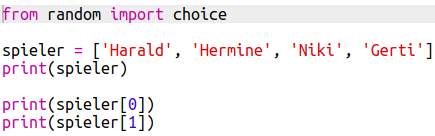
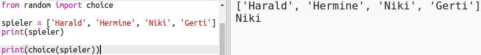
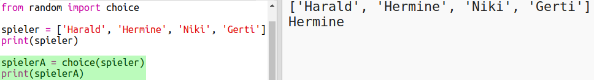
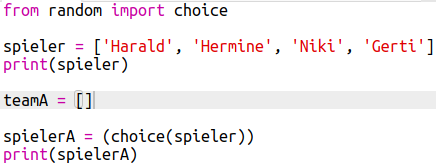
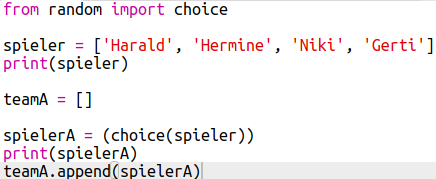
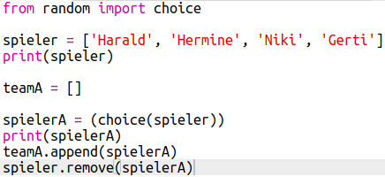
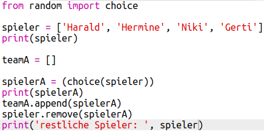

## Zufällig ausgesuchte Mitspieler

Lass uns Spieler zufällig auswählen!

+ Um einen zufälligen Spieler von deiner Liste `spieler` zu bekommen, musst du zuerst den Teil `choice ` des Moduls `random` importieren.
    
    

+ Um einen zufälligen Spieler zu erhalten, kannst du die Option `choice` verwenden. (Du kannst den Code zum Ausgeben für aller Spieler auch löschen, um einzelne Spieler auszugeben.)
    
    

+ Teste deinen `choice` Code ein paar Mal und es sollte jedes Mal eine anderer Spieler ausgewählt werden.

+ Du kannst auch eine neue Variable mit dem Namen `spielerA` erstellen und sie dann zum Speichern deines zufälligen Spielers zu verwenden.
    
    

+ Du benötigst eine neue Liste, um alle Spieler in Team A zu speichern. Zunächst sollte diese Liste leer sein.
    
    

+ Du kannst jetzt deinen zufällig ausgewählten Spieler zu `teamA` hinzufügen. Dazu kannst du `teamA.append` (**append** bedeutet am Ende hinzufügen).
    
    

+ Nachdem ein Spieler ausgewählt wurde, kannst du ihn aus der Liste `spieler` entfernen.
    
    

+ Teste diesen Code, indem du eine Ausgabe mit `print` hinzufügst, um die noch auswählbaren Elemente der Liste `spieler` anzuzeigen.
    
    
    
    In the example above, Hermione has been chosen for `teamA`, and so has been removed from the list of `players`.