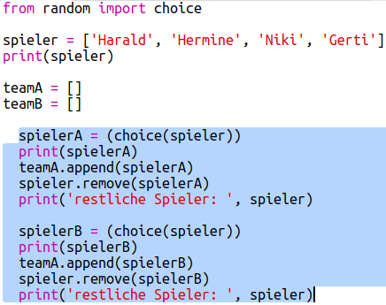
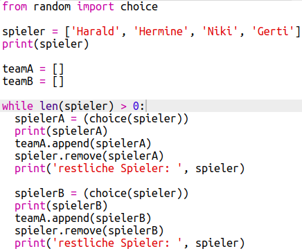
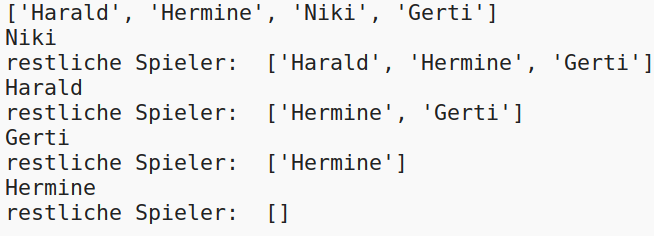
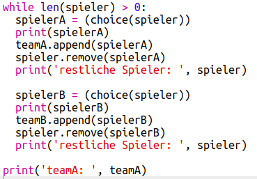
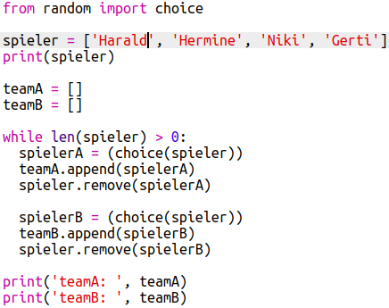
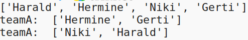

## Viele Mitspieler wählen

Als Nächstes musst du sicherstellen, dass jeder Spieler für eines der Teams ausgewählt wurde.

+ Markiere deinen Code für die Auswahl der Spieler für Team A und Team B und drücke die Tabulatortaste, um den Code einzurücken.
    
    

+ Add a **while** loop to keep choosing players until the length of the `players` list is 0.
    
    

+ Run your code to test it. You should see players being chosen for team A and team B until there are no more players left.
    
    

+ Add code to print your `teamA` list **after** your `while` loop (making sure it is not indented).
    
    This means that `teamA` will only be printed once, after all the players have been chosen.
    
    

+ You can do the same for `teamB`, and you can also delete the other print commands, as they were only there to test your code.
    
    Here's how your code should look:
    
    

+ Test your code again and you should just see your list of players as well as your final teams.
    
    