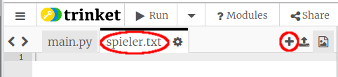
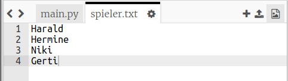
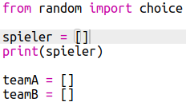
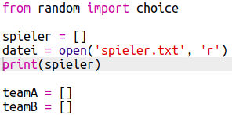
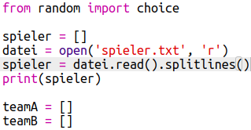

## Dateien

Du kannst eine Datei verwenden, um deine Spielerliste zu speichern.

+ Klicke auf das + -Symbol und erstelle eine neue Datei mit dem Namen `spieler.txt`.
    
    

+ Füge deine Spieler deiner neuen Datei hinzu. Stelle sicher, dass sich nach deinem letzten Spieler keine Leerzeile befindet.
    
    

+ Ändere deine Liste `spieler`, so dass sie leer ist.
    
    

+ Öffne deine Datei `spieler.txt` (das `'r'` bedeutet schreibgeschützt).
    
    

+ Lese die Liste aus der Datei und fügen Sie sie der Liste `spieler` hinzu. (Der Code `splitlines` bedeutet, dass jede Zeile in der Datei ein neues Element in der Liste `spieler` ist).
    
    

+ Wenn du deinen Code testest, sollte er genauso funktionieren wie zuvor. Es ist nun jedoch viel einfacher, Spieler zu der Datei `spieler.txt` hinzuzufügen.