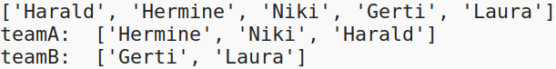

## Ungerade Anzahl an Mitspielern

Lass uns dein Programm verbessern, um mit einer ungeraden Anzahl von Spielern arbeiten zu können.

+ Füge einen anderen Namen zu deiner Liste in `spieler.txt`, so dass eine ungerade Anzahl von Spielern hast.
    
    

+ Wenn du deinen Code testest, wird eine Fehlermeldung angezeigt.
    
    

+ Der Fehler liegt darin, dass dein Programm abwechselnd zufällige Spieler für Team A und dann Team B auswählt. Wenn jedoch eine ungerade Anzahl von Spielern vorhanden ist, kannst du nach Auswahl des letzten Spielers für Team A keinen Spieler mehr für Team B auswählen.
    
    Um diesen Fehler zu beheben, kannst du dein Programm anweisen mittels `break` die `while` Schleife zu verlassen, wenn die Liste deiner `Spieler` leer ist.
    
    

+ Wenn du deinen Code erneut testest, solltest du feststellen, dass er jetzt auch mit einer ungeraden Anzahl von Spielern funktioniert.
    
    