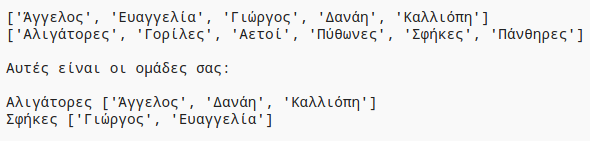

## Εισαγωγή:

Σε αυτό το έργο, θα μάθεις να δημιουργείς 2 τυχαίες ομάδες από μια λίστα παικτών.

  <iframe src="https://trinket.io/embed/python/6c115015e3?outputOnly=true&start=result" width="600" height="500" frameborder="0" marginwidth="0" marginheight="0" allowfullscreen>
  </iframe>
  

### Πρόσθετες πληροφορίες για τους συντονιστές των ομάδων

Αν χρειαστεί να εκτυπώσεις αυτό το έργο, χρησιμοποίησε την [εκτυπώσιμη έκδοση](https://projects.raspberrypi.org/el-GR/projects/team-chooser/print).

--- collapse ---
---
title: Σημειώσεις συντονιστή ομάδας
---
## Εισαγωγή:

Σε αυτό το έργο, τα παιδιά θα μάθουν να κάνουν ένα πρόγραμμα για να χωρίσουν μια λίστα παικτών σε 2 τυχαίες ομάδες. Σε αυτό το έργο θα μάθεις για τις λίστες και τη χρήση αρχείων.

## Online Πόροι

**Αυτό το πρόγραμμα χρησιμοποιεί Python 3.** Συνιστούμε να χρησιμοποιήσεις [trinket](https://trinket.io/) για να γράψεις Python online. Το έργο αυτό περιλαμβάνει τα ακόλουθα Trinkets:

* [Νέο (κενό) Python Trinket - jumpto.cc/python-new](http://jumpto.cc/python-new)

Υπάρχει επίσης ένα trinket που περιέχει το ολοκληρωμένο έργο:

* ['Επιλογή Ομάδας' Ολοκληρωμένο -- trinket.io/python/6c115015e3](https://trinket.io/python/6c115015e3)

## Offline Πόροι

Το έργο αυτό μπορεί να [ολοκληρωθεί χωρίς σύνδεση](https://www.codeclubprojects.org/en-GB/resources/python-working-offline/) αν προτιμάς. Μπορείς να αποκτήσεις πρόσβαση στους πόρους του έργου κάνοντας κλικ στο σύνδεσμο «Υλικό έργου» για αυτό το έργο. Αυτός ο σύνδεσμος περιέχει μια ενότητα "Πόροι έργου", η οποία περιλαμβάνει υλικό που τα παιδιά θα χρειαστούν για να ολοκληρώσουν αυτό το έργο εκτός σύνδεσης. Βεβαιώσου ότι κάθε παιδί έχει πρόσβαση σε ένα αντίγραφο αυτών των πόρων. Αυτή η ενότητα περιλαμβάνει τα ακόλουθα αρχεία:

* team/team.py

Μπορείς επίσης να βρεις μια ολοκληρωμένη έκδοση αυτού του έργου στην ενότητα «Πόροι εθελοντών», η οποία περιέχει:

* team-finished/team.py

(Όλοι οι παραπάνω πόροι μπορούν επίσης να κατέβουν ως συμπιεσμένα `.zip` αρχεία.)

## Στόχοι μάθησης

* Λίστες
* Φόρτωση δεδομένων λίστας από ένα αρχείο.

Αυτό το έργο καλύπτει στοιχεία από τις ακόλουθες πτυχές του [Προγράμματος Μαθημάτων Ψηφιακής Δημιουργίας του Raspberry Pi](https://rpf.io/curriculum):

* [Χρησιμοποίησε βασικές δομές προγραμματισμού για να δημιουργήσεις απλά προγράμματα.](https://www.raspberrypi.org/curriculum/programming/creator)

## Προκλήσεις

* "Προσθήκη περισσότερων παικτών" - προσθήκη στοιχείων σε μια λίστα `παικτών`.
* "Επιλογή για την ομάδα Β" - δημιουργώντας μια νέα λίστα `teamB` για να προσθέσεις τυχαίους παίκτες.
* "Τυχαία ονόματα ομάδων" - Δημιουργία και χρήση νέας λίστας `teamNames` για την εκχώρηση τυχαίων ονομάτων στις ομάδες.
* "Αποθήκευση ονομάτων ομάδων" - αποθήκευση ονομάτων ομάδων σε αρχείο και φόρτωσή τους στη μεταβλητή `teamNames`.
* "Περισσότερες ομάδες" - οι παίκτες χωρίζονται σε 3 ομάδες αντί για 2.

--- /collapse ---

--- collapse ---
---
title: Υλικό έργου
---
## Πόροι έργου

* [αρχείο .zip που περιέχει όλους τους πόρους του έργου](resources/team-chooser-project-resources.zip)
* [Online κενό Python Trinket](http://jumpto.cc/python-new)
* [Offline κενό αρχείο Python](resources/new-new.py)

## Πόροι συντονιστή ομάδας

* [Αρχείο .zip που περιέχει όλους τους ολοκληρωμένους πόρους του έργου](resources/team-chooser-volunteer-resources.zip)
* [Online ολοκληρωμένο έργο στο Τrinket](https://trinket.io/python/6c115015e3)
* [team-chooser-finished/team-chooser.py](resources/team-chooser-finished-team-chooser.py)

--- /collapse ---