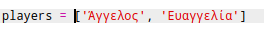
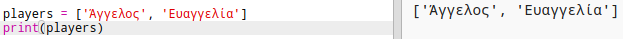
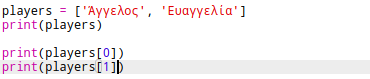

## Παίκτες

Ας ξεκινήσουμε δημιουργώντας μια λίστα παικτών για να διαλέξεις.

+ Άνοιξε το κενό πρότυπο Python Trinket: <a href="http://jumpto.cc/python-new" target="_blank">jumpto.cc/python-new</a>.

+ Μπορείς να χρησιμοποιήσεις μια μεταβλητή για να αποθηκεύσεις μια **λίστα** παικτών. Η λίστα πρέπει να είναι σε αγκύλες `[]`, με κόμμα ανάμεσα σε κάθε στοιχείο της.
    
    Ξεκίνα προσθέτοντας μια λίστα παικτών στο πρόγραμμά σου.
    
    

+ Πρόσθεσε αυτόν τον κώδικα για να εμφανίσεις τη μεταβλητή `players`:
    
    

+ Μπορείς να διαβάσεις ένα στοιχείο της λίστας προσθέτοντας τη θέση του ανάμεσα σε αγκύλες μετά το όνομα της λίστας.
    
    Το πρώτο στοιχείο της λίστας είναι στη θέση **0**. Αυτό είναι διαφορετικό από το Scratch, στο οποίο αρχίζει στη θέση 1.
    
    