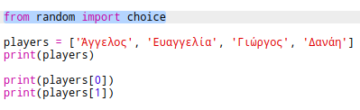
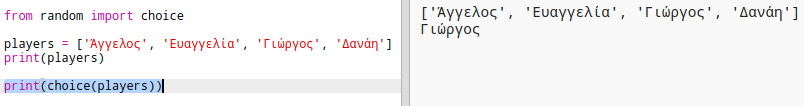
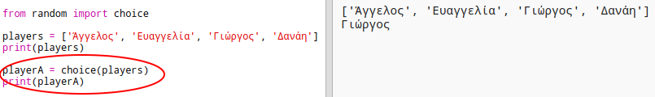
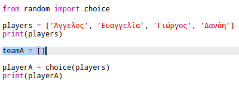
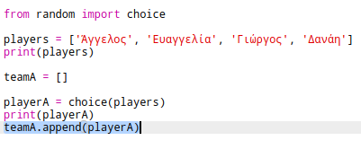
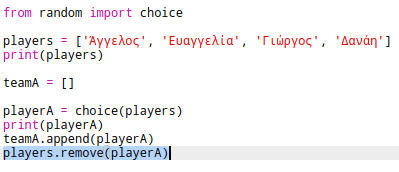
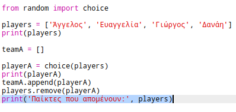

## Τυχαίοι παίκτες

Ας επιλέξουμε τυχαίους παίκτες!

+ Για να είσαι σε θέση να πάρεις έναν τυχαίο παίκτη από τη λίστα `players`, θα χρειαστεί πρώτα να εισάγεις την `choice` από τη python βιβλιοθήκη `random`.
    
    

+ Για να πάρεις έναν τυχαίο παίκτη, μπορείς να χρησιμοποιήσεις την `choice`. (Μπορείς επίσης να διαγράψεις τον κώδικα για να εμφανίσεις μεμονωμένους παίκτες.)
    
    

+ Δοκίμασε τον κώδικα με την `choice` μερικές φορές και θα πρέπει να βλέπεις ένα διαφορετικό παίκτη να επιλέγεται κάθε φορά.

+ Μπορείς επίσης να δημιουργήσεις μια νέα μεταβλητή που ονομάζεται `playerA` για να αποθηκεύεις τον τυχαίο παίκτη σου.
    
    

+ Θα χρειαστείς μια νέα λίστα για να αποθηκεύεις όλους τους παίκτες της ομάδας Α. Αυτή η λίστα στην αρχή πρέπει να είναι κενή.
    
    

+ Τώρα μπορείς να προσθέσεις τον τυχαία επιλεγμένο παίκτη σου στη λίστα `teamA`. Για να γίνει αυτό, μπορείς να χρησιμοποιήσεις την εντολή `teamA.append` (**append** σημαίνει προσθήκη στο τέλος).
    
    

+ Τώρα που έχει επιλεγεί ο παίκτης σου, μπορείς να τον αφαιρέσεις από τη λίστα παικτών `players`.
    
    

+ Δοκίμασε αυτόν τον κώδικα προσθέτοντας μια εντολή `print`, για να εμφανίσεις τους παίκτες που απέμειναν στη λίστα `players`.
    
    
    
    Στο παραπάνω παράδειγμα, o Γιώργος έχει επιλεγεί για την ομάδα `teamA`, και έτσι έχει αφαιρεθεί από τη λίστα παικτών `players`.