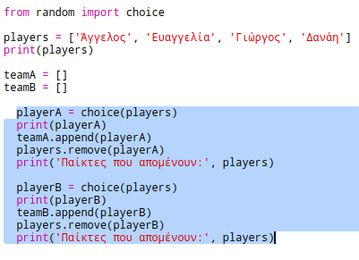
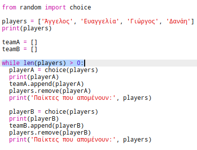
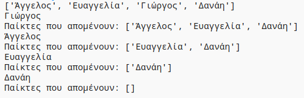
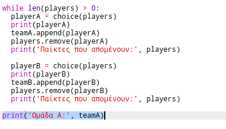
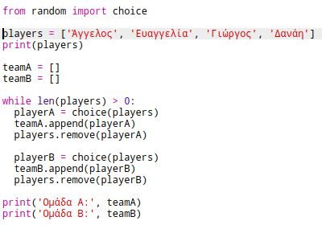
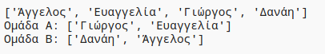

## Επιλογή πολλών παικτών

Στη συνέχεια θα πρέπει να βεβαιωθείς ότι κάθε παίκτης έχει επιλεγεί για μια ομάδα.

+ Επέλεξε τον κώδικα για την επιλογή παικτών για την ομάδα Α και την ομάδα Β και πάτησε το πλήκτρο tab για να κάνεις μια εσοχή.
    
    

+ Πρόσθεσε ένα βρόχο **while** για να επιλέγεις παίκτες μέχρις ότου το πλήθος της λίστας παικτών `players` γίνει 0.
    
    

+ Εκτέλεσε τον κώδικα για να τον δοκιμάσεις. Θα πρέπει να βλέπεις παίκτες να επιλέγονται για την ομάδα Α και την ομάδα Β μέχρι να μην έχει απομείνει κανένας.
    
    

+ Πρόσθεσε κώδικα για να εμφανίσεις τη λίστα `teamA` **μετά από** τον βρόχο `while` (βεβαιώσου ότι ο κώδικας δεν είναι σε εσοχή).
    
    Αυτό σημαίνει ότι η λίστα `teamA` θα εκτυπωθεί μόνο μία φορά, αφού έχουν επιλεγεί όλοι οι παίκτες.
    
    

+ Μπορείς να κάνεις το ίδιο για τη λίστα `teamB`, και επίσης να διαγράψεις τις άλλες εντολές εμφάνισης, καθώς ήταν μόνο για τον έλεγχο του κώδικα.
    
    Έτσι πρέπει να φαίνεται ο κώδικας:
    
    

+ Δοκίμασε ξανά τον κώδικα και θα πρέπει να βλέπεις μόνο τη λίστα των παικτών καθώς και τις τελικές ομάδες.
    
    