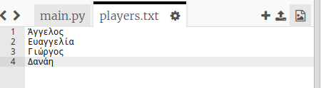

## Αρχεία

Μπορείς να χρησιμοποιήσεις ένα αρχείο για να αποθηκεύσεις τη λίστα των παικτών σου.

+ Κάνε κλικ στο εικονίδιο + και δημιούργησε ένα νέο αρχείο που ονομάζεται `players.txt`.
    
    

+ Πρόσθεσε πληκτρολογώντας τους παίκτες σου στο νέο αρχείο. Βεβαιώσου ότι δεν υπάρχει κενή γραμμή μετά τον τελευταίο παίκτη.
    
    

+ Άλλαξε στο πρόγραμμα τη λίστα παικτών `players` ώστε να είναι κενή.
    
    

+ Άνοιξε το αρχείο `players.txt` (το `'r'` σημαίνει μόνο για ανάγνωση).
    
    

+ Διάβασε τους παίκτες από το αρχείο και πρόσθεσέ τους στη λίστα `players`. (Ο κώδικας `splitlines` σημαίνει ότι κάθε γραμμή του αρχείου είναι ένα νέο στοιχείο στη λίστα `players`).
    
    

+ Εάν δοκιμάσεις τον κώδικα, θα πρέπει να λειτουργεί ακριβώς όπως και πριν. Ωστόσο, τώρα είναι πολύ πιο εύκολο να προσθέσεις παίκτες στο αρχείο `players.txt`.