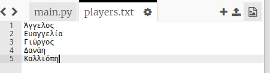
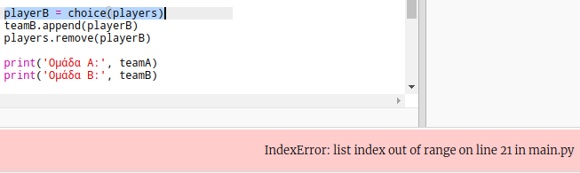
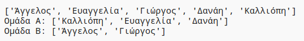

## Περιττός αριθμός παικτών

Ας βελτιώσουμε το πρόγραμμά σου ώστε να λειτουργεί και με περιττό αριθμό παικτών.

+ Πρόσθεσε άλλο ένα όνομα στο αρχείο `players.txt`, ώστε να έχεις περιττό αριθμό παικτών.
    
    

+ Εάν δοκιμάσεις τον κώδικα, θα δεις ότι εμφανίζεται μήνυμα σφάλματος.
    
    

+ Το σφάλμα οφείλεται στο γεγονός ότι το πρόγραμμά σου εξακολουθεί να επιλέγει τυχαίους παίκτες για την ομάδα Α και στη συνέχεια για την ομάδα Β. Ωστόσο, εάν υπάρχει περιττός αριθμός παικτών, τότε μετά την επιλογή παίκτη για την ομάδα Α δεν υπάρχουν παίκτες για την ομάδα Β.
    
    Για να διορθώσεις αυτό το σφάλμα, μπορείς να πεις στο πρόγραμμά σου να σπάσει με την εντολή `break` το βρόχο `while` μόλις η λίστα παικτών `players` αδειάσει.
    
    

+ Εάν δοκιμάσεις ξανά τον κώδικα, θα πρέπει τώρα να λειτουργεί και με περιττό αριθμό παικτών.
    
    