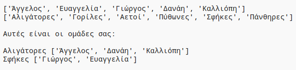

--- challenge ---

## Πρόκληση: Τυχαία ονόματα ομάδων

Μπορείς να δώσεις και στις δύο ομάδες σου τυχαία ονόματα;

Μπορείς να δημιουργήσεις μια λίστα που ονομάζεται `teamNames` που να περιέχει ονόματα ομάδων.

Στη συνέχεια, μπορείς να επιλέξεις (και να εμφανίσεις) ένα τυχαίο όνομα για κάθε ομάδα.

--- /challenge ---