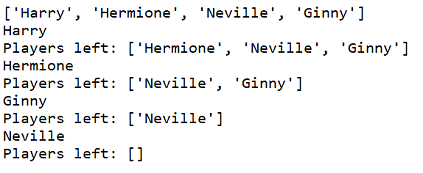

--- challenge ---
## Challenge: Choosing for team B
Can you add code to choose a player at random for team B? You'll need to:

+ Create a new `teamB` list
+ Choose a random player for team B (called `playerB`)
+ `append` the chosen player to your `teamB` list
+ `remove` the chosen player from your list of `players`

The code you'll need for `teamB` will be __very__ similar to the code you've already written for `teamA`!

## Step 3: Choosing lots of players

Next you'll need to make sure that every player has been chosen for a team.

+ Highlight your code for choosing players for team A and team B and press the tab key to indent the code.

	

+ Add a __while__ loop to keep choosing players until the length of the `players` list is 0.

	

+ Run your code to test it. You should see players being chosen for team A and team B until there are no more players left.

	

+ Add code to print your `teamA` list __after__ your `while` loop (making sure it is not indented).

	This means that `teamA` will only be printed once, after all the players have been chosen.

	

+ You can do the same for `teamB`, and you can also delete the other print commands, as they were only there to test your code.

	Here's how your code should look:

	

+ Test your code again and you should just see your list of players as well as your final teams.

	

## Step 4: Files

You can use a file to store your list of players.

+ Click the + icon and create a new file called `players.txt`.

	

+ Add your players to your new file. Make sure that there is no blank line after your last player.

	

+ Change your `players` list so that it is empty.

	

+ Open your `players.txt` file (the `'r'` means read-only).

	

+ Read the list from the file and add to your `players` list. (The `splitlines` code means that every line in the file is a new item in the `players` list).

	

+ If you test your code, it should work exactly the same as before. However, now it's much easier to add players to your `players.txt` file.

## Step 5: Odd players

Let's improve your program to work with an odd number of players.

+ Add another name to your `players.txt` list, so that you have an odd number of players.

	

+ If you test your code, you'll see that you get an error message.

	

+ The error is because your program keeps choosing random players for team A and then team B. However, if there is an odd number of players then after choosing a player for team A there are no players left to choose from for team B.

	To fix this bug, you can tell your program to `break` out of your `while` loop if your `players` list is empty.

	

+ If you test your code again, you should see that it now works with an odd number of players.

	

--- /challenge ---