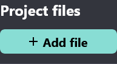
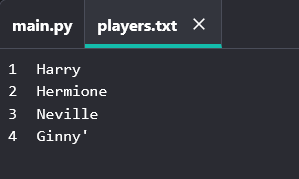

## Files

You can use a file to store your list of players.

--- task ---

Click **Add file** and create a new file called `players.txt`.

--- /task ---

--- task ---

+ Add your players to your new file. Make sure that there is no blank line after your last player.

--- /task ---

--- task ---

Change your `players` list so that it is empty.

--- code ---
---
language: python
filename: main.py
line_numbers: true
line_number_start: 1
line_highlights: 3
---
from random import choice

players = []

team_A = []
team_B = []
--- /code ---

--- /task ---

--- task ---

Open your `players.txt` file (the `'r'` means read-only).

--- code ---
---
language: python
filename: main.py
line_numbers: true
line_number_start: 1
line_highlights: 4
---
from random import choice

players = []
file = open('players.txt', 'r')

team_A = []
team_B = []
--- /code ---

--- /task ---

--- task ---

Read the list from the file and add to your `players` list. (The `splitlines` code means that every line in the file is a new item in the `players` list).

--- code ---
---
language: python
filename: main.py
line_numbers: true
line_number_start: 1
line_highlights: 5
---
from random import choice

players = []
file = open('players.txt', 'r')
players = file.read().splitlines()

team_A = []
team_B = []
--- /code ---

--- /task ---

--- task ---

If you test your code, it should work exactly the same as before. However, now it's much easier to add players to your `players.txt` file.

--- /task ---

