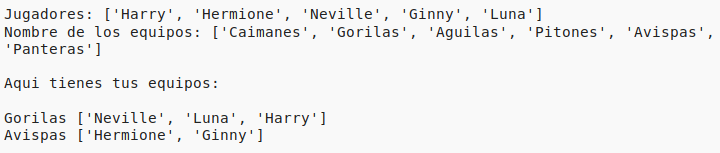

## Introducción:

En este proyecto, aprenderás cómo crear 2 equipos al azar a partir de una lista de jugadores.

  <iframe src="https://trinket.io/embed/python/a699c44ce6?outputOnly=true&start=result" width="600" height="500" frameborder="0" marginwidth="0" marginheight="0" allowfullscreen>
  </iframe>
  

### Información adicional para los líderes de los clubes

Si necesitas imprimir este proyecto, usa la [versión para imprimir](https://projects.raspberrypi.org/en/projects/team-chooser/print).

## \--- collapse \---

## title: Notas para el líder del club

## Introducción:

En este proyecto, los niños aprenderán cómo hacer un programa para dividir una lista de jugadores en 2 equipos al azar. Este proyecto enseña las listas y el uso de archivos.

## Recursos en línea

**Este proyecto usa Python 3.** Recomendamos el uso de [trinket](https://trinket.io/) para escribir Python en línea. Este proyecto contiene los Trinkets siguientes:

* [Trinket nuevo (en blanco) -- jumpto.cc/python-new](http://jumpto.cc/python-new)

También hay un Trinket que contiene el proyecto completo:

* [‘Seleccionador de equipo’ acabado -- trinket.io/python/a699c44ce6](https://trinket.io/python/a699c44ce6)

## Recursos sin conexión

Este proyecto se puede [completar sin conexión](https://www.codeclubprojects.org/en-GB/resources/python-working-offline/) si se prefiere. Se puede acceder a los recursos del proyecto haciendo clic en el enlace 'Materiales del proyecto' para este proyecto. Este enlace contiene una sección de 'Recursos del proyecto', que incluye los recursos que los niños necesitarán para completar este proyecto sin conexión. Asegúrese de que cada niño tenga acceso a una copia de estos recursos. Esta sección incluye los siguientes archivos:

* team/team.py

También se puede encontrar una versión completa de este proyecto en la sección 'Recursos para voluntarios', que contiene:

* team-finished/team.py

(Todos los recursos anteriores también se pueden descargar como archivos `.zip` de proyectos y voluntarios.)

## Objetivos del Aprendizaje

* Listas;
* Cargar datos de la lista de un archivo.

Este proyecto incluye elementos de los siguientes aspectos del [Raspberry Pi Digital Making Curriculum](http://rpf.io/curriculum):

* [Uso de estructuras de programación básicas para crear programas simples.](https://www.raspberrypi.org/curriculum/programming/creator)

## Retos

* "Agregar más jugadores" - agregar elementos a la lista `jugadores`;
* "Eligiendo para el equipo B" - crear una nueva lista `equipoB` para agregar jugadores aleatorios;
* "Nombres de equipos aleatorios" - crear y usar una nueva lista `nombresEquipos` para asignar nombres al azar a los equipos;
* "Almacenamiento de nombres de equipos" - almacenar los nombres de los equipos en un archivo y cargarlos en una variable `nombresEquipos`;
* "Más equipos" - dividir a los jugadores en 3 equipos en lugar de 2.

\--- /collapse \---

## \--- collapse \---

## title: Materiales del proyecto

## Recursos del proyecto

* Puedes [encontrar los recursos para este proyecto aquí](http://rpf.io/p/en/team-chooser-go){: target="_blank"}.
* [Trinket Python en blanco en línea](http://jumpto.cc/python-new)
* [Trinket Python en blanco sin conexión](resources/new-new.py)

## Recursos para los líderes de clubes

* Puedes [encontrar la solución para este proyecto aquí](http://rpf.io/p/en/team-chooser-get){:target="_blank"}.
* [Proyecto Trinket terminado en línea](https://trinket.io/python/a699c44ce6)
* [team-chooser-finished/team-chooser.py](resources/team-chooser-finished-team-chooser.py)

\--- /collapse \---