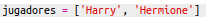
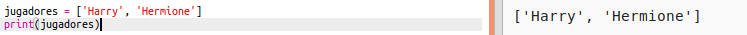
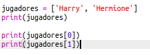

## Jugadores

Vamos a empezar por crear una lista de jugadores para elegir.

+ Abre la plantilla Python en blanco en Trinket: <a href="https://trinket.io/python/204ebc7605" target="_blank">jumpto.cc/python-new</a>.

+ Puedes usar una variable para almacenar una **lista** de jugadores. La lista debe estar entre corchetes `[ ]`, con una coma entre cada elemento de la lista.
    
    Empieza añadiendo una lista de jugadores a tu programa.
    
    

+ Añade este código para imprimir tu variable `jugadores`:
    
    

+ Puedes acceder a un elemento de la lista agregando su posición entre corchetes después del nombre de la variable.
    
    El primer elemento de la lista se encuentra en la **posición 0**. Esto es diferente a Scratch, que comienza en la posición 1.
    
    