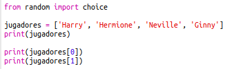
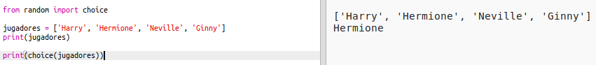
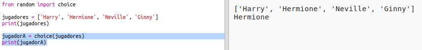
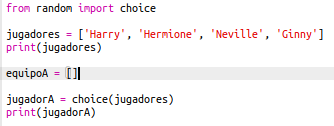
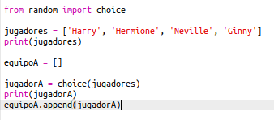
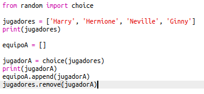
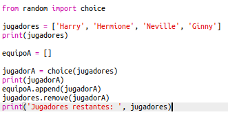

## Jugadores aleatorios

¡Vamos a elegir jugadores al azar!

+ Para poder obtener un jugador aleatorio de tu lista `jugadores`, primero tienes que importar `choice` que es parte del módulo `random`.
    
    

+ Para obtener un jugador aleatorio, puedes utilizar `choice`. (También puedes eliminar el código para imprimir jugadores individuales.)
    
    

+ Prueba tu código `choice` varias veces y deberías ver a un jugador diferente cada vez.

+ También puedes crear una nueva variable llamada `jugadorA`, y usarla para guardar tu jugador aleatorio.
    
    

+ You'll need a new list to store all of the players in team A. To start with, this list should be empty.
    
    

+ You can now add your randomly chosen player to `teamA`. To do this, you can use `teamA.append` (**append** means add to the end).
    
    

+ Now that your player has been chosen, you can remove them from your list of `players`.
    
    

+ Test this code by adding a `print` command, to show the `players` left to choose from.
    
    
    
    In the example above, Hermione has been chosen for `teamA`, and so has been removed from the list of `players`.