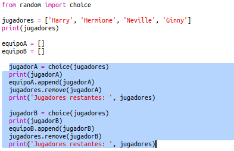
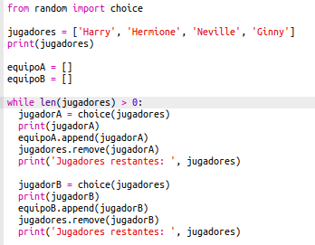
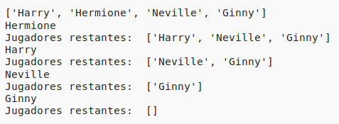
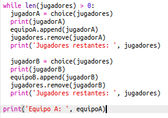
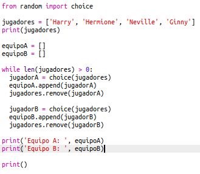
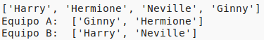

## Selección de muchos jugadores

A continuación, debes asegurarte de que cada uno de los jugadores se encuentra seleccionado para uno de los equipos.

+ Marca el código para seleccionar jugadores para el equipo A y el equipo B y pulsa la tecla de tabulación para sangrar el código.

	

+ Añade un bucle __while__ para continuar seleccionando jugadores hasta que no queden jugadores en la lista. 

	

+ Ejecuta el código para probarlo. Debes ser capaz de ver cómo los jugadores son seleccionados para el equipo A y el equipo B hasta que no quede ninguno.

	

+ Añade el código para imprimir tu lista `teamA`__después__ de tu bucle`while` (asegurándote de que no haya sangrado).

	Esto quiere decir que `teamA` solamente se imprimirá una vez después de que se hayan seleccionado todos los jugadores.

	

+ Puedes hacer lo mismo para `teamB` y puedes borrar los otros comandos de impresión, puesto que solamente los teníamos para probar el código.

	A continuación tienes un ejemplo del aspecto que debería tener tu código:

	

+ Vuelve a probar tu código y verás tu lista de jugadores además de la lista con los equipos finales.

	

