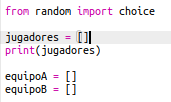
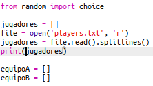

## Archivos

Podrás usar un archivo para almacenar tu lista de jugadores.

+ Haz clic en el icono + y crea un nuevo archivo denominado `players.txt`.

	

+ Añade tus jugadores al nuevo archivo. Asegúrate de que no haya líneas en blanco después de tu último jugador.

	

+ Cambia tu lista `players` de modo que quede vacía.

	

+ Abre tu archivo `players.txt` (`'r'` significa solo lectura).

	

+ Lee la lista desde el archivo y añádela a tu lista `players`. (El código `splitlines` quiere decir que cada línea del archivo es un nuevo elemento en la lista `players`).

	

+ Al probar tu código, verás que funciona exactamente igual que antes. Sin embargo, ahora resultará mucho más fácil añadir jugadores al archivo `players.txt`.

