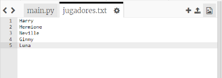
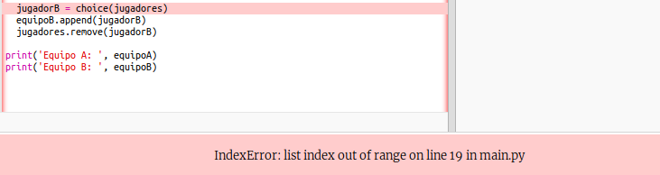
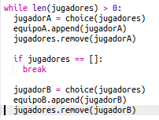
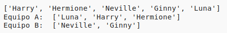

## Jugadores impares

Mejoremos tu programa para que pueda trabajar con un número impar de jugadores.

+ Añade otro nombre a tu lista `players.txt`, para que tengas un número impar de jugadores.
    
    

+ Si pruebas tu código, verás que aparece un mensaje de error.
    
    

+ The error is because your program keeps choosing random players for team A and then team B. However, if there is an odd number of players then after choosing a player for team A there are no players left to choose from for team B.
    
    To fix this bug, you can tell your program to `break` out of your `while` loop if your `players` list is empty.
    
    

+ If you test your code again, you should see that it now works with an odd number of players.
    
    