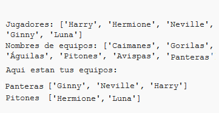

## Introduction:

En este proyecto, aprenderás cómo crear 2 equipos aleatorios a partir de una lista de jugadores.

  <iframe src="https://trinket.io/embed/python/a699c44ce6?outputOnly=true&start=result" width="600" height="500" frameborder="0" marginwidth="0" marginheight="0" allowfullscreen>
  </iframe>
  

### Información adicional para los líderes del club

Si necesitas imprimir este proyecto, usa la [versión lista para imprimir](https://projects.raspberrypi.org/en/projects/team-chooser/print).

## \--- collapse \---

## title: Notas para el líder del club

## Introducción:

En este proyecto, los niños aprenderán cómo hacer un programa para dividir una lista de jugadores en 2 equipos aleatorios. Este proyecto enseña las listas y el uso de archivos.

## Recursos en línea

**Este proyecto utiliza Python 3.** Recomendamos usar [trinket](https://trinket.io/) para escribir Python en línea. Este proyecto contiene los siguientes Trinkets:

* [Python Trinket nuevo (en blanco) -- jumpto.cc/python-new](http://jumpto.cc/python-new)

También hay un Trinket que contiene al proyecto concluido:

* [‘Seleccionador de equipo’ concluido -- trinket.io/python/a699c44ce6](https://trinket.io/python/a699c44ce6)

## Recursos sin conexión

Si prefiere, este proyecto se puede [completar offline](https://www.codeclubprojects.org/en-GB/resources/python-working-offline/). Puedes acceder a los recursos del proyecto haciendo clic en el enlace 'Materiales del proyecto' para este proyecto. Este enlace contiene una sección de 'Recursos del Proyecto', que incluye los recursos que los niños necesitarán para completar este proyecto offline. Asegúrate de que cada niño tenga acceso a una copia de estos recursos. Esta sección incluye los siguientes archivos:

* team/team.py

Además, puedes encontrar una versión completa de este proyecto en la sección 'Recursos para Voluntarios', que contiene:

* team-finished/team.py

(Todos los recursos anteriores también se pueden descargar como archivos `.zip` de proyectos y voluntarios.)

## Objetivos del Aprendizaje

* Listas;
* Cargar una lista de datos desde un archivo.

Este proyecto incluye elementos de los siguientes aspectos del [Raspberry Pi Digital Making Curriculum](http://rpf.io/curriculum):

* [Use basic programming constructs to create simple programs.](https://www.raspberrypi.org/curriculum/programming/creator)

## Challenges

* "Adding more players" - adding elements to a `players` list;
* "Choosing for team B" - creating a new `teamB` list to add random players to;
* "Random team names" - creating and using a new `teamNames` list to assign random names to teams;
* "Storing team names" - storing team names in a file, and loading them into a `teamNames` variable;
* "More teams" - splitting players into 3 teams instead of 2.

\--- /collapse \---

## \--- collapse \---

## title: Project materials

## Project resources

* You can [find the resources for this project here](http://rpf.io/p/en/team-chooser-go){:target="_blank"}.
* [Online blank Python Trinket](http://jumpto.cc/python-new)
* [Offline blank Python file](resources/new-new.py)

## Club leader resources

* You can [find the solutions for this project here](http://rpf.io/p/en/team-chooser-get){:target="_blank"}.
* [Online completed Trinket project](https://trinket.io/python/a699c44ce6)
* [team-chooser-finished/team-chooser.py](resources/team-chooser-finished-team-chooser.py)

\--- /collapse \---