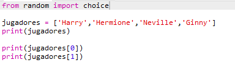
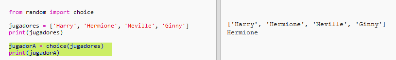
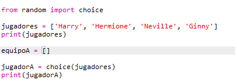
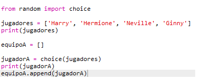
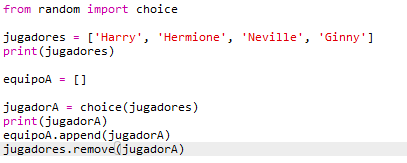
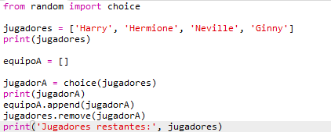

## Jugadores aleatorios

¡Vamos a elegir jugadores aleatoriamente!

+ Para poder obtener un jugador aleatorio de tu lista `jugadores`, primero tienes que importar `choice` que es parte del módulo `random`.
    
    

+ Para obtener un jugador aleatorio, puedes utilizar `choice`. (También puedes eliminar el código para imprimir jugadores individuales.)
    
    

+ Prueba tu código `choice` varias veces y deberías ver a un jugador diferente cada vez.

+ También puedes crear una nueva variable llamada `jugadorA`, y usarla para guardar tu jugador aleatorio.
    
    

+ Necesitarás una nueva lista para almacenar a todos los jugadores en el equipo A. Para empezar, esta lista debe estar vacía.
    
    

+ Ahora puedes añadir tu jugador elegido al azar a `equipoA`. Para hacer esto, puedes usar `equipoA.append` (**append** significa añadir al final).
    
    

+ Ahora que su jugador ha sido elegido, puede eliminarlo de su lista de ` jugadores `.
    
    

+ Prueba este código añadiendo un comando `print`, para mostrar los `jugadores` que quedan por elegir.
    
    
    
    En el ejemplo anterior, Hermione ha sido elegida para el `equipoA`, y ha sido eliminada de la lista de `jugadores`.