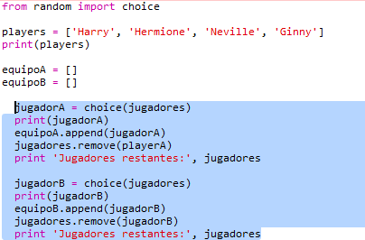
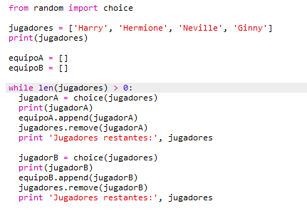
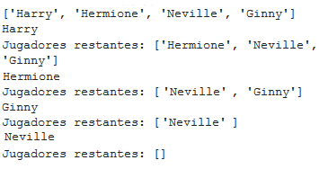
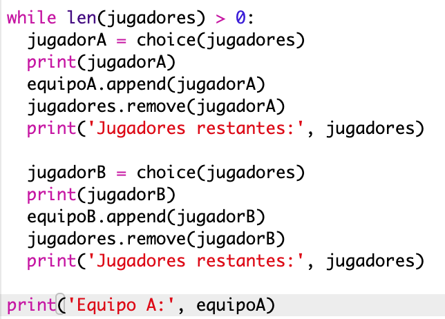
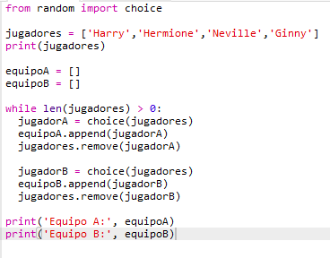
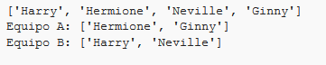

## Selección de muchos jugadores

A continuación, deberás asegurarte de que cada jugador ha sido elegido para un equipo.

+ Selecciona tu código para elegir jugadores para el equipo A y el equipo B y presiona la tecla de tabulación para añadir sangría al código.
    
    

+ Añade un bucle **while** para seguir eligiendo jugadores hasta la longitud de la lista `jugadores` sea 0.
    
    

+ Ejecuta tu código para probarlo. Deberías ver a los jugadores ser elegidos para el equipo A y el equipo B hasta que no queden más jugadores.
    
    

+ Añade el código para imprimir tu lista `equipoA` **después de** tu bucle `while` (asegurándote de que no tenga sangría).
    
    Esto significa que `equipoA` solo se mostrará una vez, después de que todos los jugadores hayan sido elegidos.
    
    

+ Puedes hacer lo mismo para el `equipoB`, y también puedes eliminar los otros comandos de impresión, ya que solo estaban ahí para probar tu código.
    
    Así es como debería verse tu código:
    
    

+ Vuelve a probar tu código y deberías ver tu lista de jugadores, así como tus equipos finales.
    
    