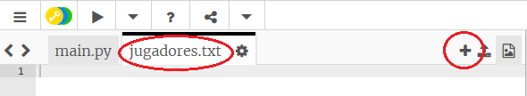
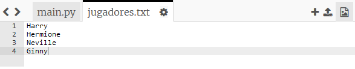
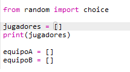
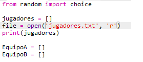
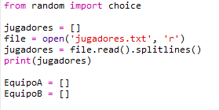

## Archivos

Puedes usar un archivo para almacenar tu lista de jugadores.

+ Haz clic en el icono + y crea un nuevo archivo llamado `jugadores.txt`.
    
    

+ Añade tus jugadores a tu nuevo archivo. Asegúrate de que no haya una línea en blanco después de tu último jugador.
    
    

+ Cambia tu lista `jugadores` para que esté vacía.
    
    

+ Abre tu archivo `jugadores.txt` (la `'r'` significa solo lectura).
    
    

+ Lee la lista del archivo y añadela a tu lista `jugadores`. (El código `splitlines` significa que cada línea en el archivo es un elemento nuevo en la lista `jugadores`).
    
    

+ Si pruebas tu código, debería funcionar exactamente igual que antes. Sin embargo, ahora es mucho más fácil añadir jugadores a tu archivo `jugadores.txt`.