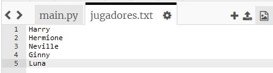
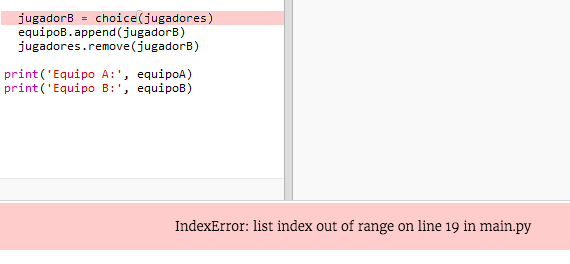
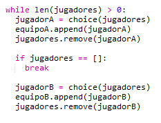
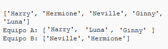

## Jugadores impares

Mejoremos tu programa para que pueda trabajar con un número impar de jugadores.

+ Añade otro nombre a tu lista `players.txt`, para que tengas un número impar de jugadores.
    
    

+ Si pruebas tu código, verás que aparece un mensaje de error.
    
    

+ El error se debe a que tu programa sigue eligiendo jugadores al azar para el equipo A y luego para el equipo B. Sin embargo, si hay un número impar de jugadores, después de elegir un jugador para el equipo A, no quedan jugadores para elegir para el equipo B.
    
    Para corregir este error, puedes decirle a tu programa que termine `break` tu bucle `while` si tu lista `jugadores` esta vacía.
    
    

+ Si vuelves a probar tu código, deberías ver que ahora funciona con un número impar de jugadores.
    
    