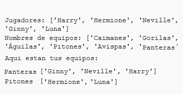

--- challenge ---

## Desafío: Nombra los equipos aleatorios

¿Puedes darle a ambos equipos un nombre al azar?

Puedes crear una lista llamada `nombresEquipos` que contenga los nombres para elegir.

A continuación, puedes elegir (y mostrar) un nombre aleatorio para cada equipo.

--- /challenge ---