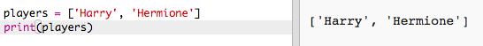

## Pelaajat

Aloitetaan luomalla luettelo pelaajista, joista voit valita.

+ Avaa tyhjä Python-mallipohja Trinket: <a href="http://jumpto.cc/python-new" target="_blank">jumpto.cc/python-new</a>.

+ Voit käyttää muuttujaa tallentamaan pelaajan **lista**. Luettelon tulisi olla hakasulkeissa `[]`, pilkulla jokaisen listan välillä.
    
    Aloita lisäämällä ohjelmien luettelo pelaajista.
    
    

+ Lisää tämä koodi tulostaa `pelaajasi` muuttuja:
    
    

+ Voit päästä kohteeseen luettelossa lisäämällä sen sijainti hakasulkeissa muuttujan nimen jälkeen.
    
    Listan ensimmäinen kohde on **asennossa 0**. Tämä eroaa Scratchistä, joka alkaa paikasta 1.
    
    