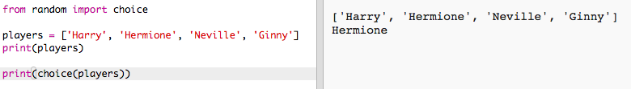
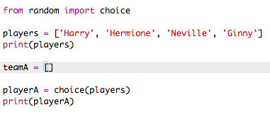

## Satunnaiset pelaajat

Let's valita satunnainen pelaajia!

+ Jotta voit saada satunnaisen soittimen sinun `pelaajasi` luettelosta, sinun on ensin tuettava `valinnainen` osa `satunnaisesta` moduulista.
    
    

+ Saadaksesi satunnaisen soittimen voit käyttää `valintaa`. (Voit myös poistaa koodin yksittäisten pelaajien tulostamiseksi.)
    
    

+ Testaa `valintasi` koodia muutaman kerran ja sinun pitäisi nähdä eri pelaaja valittaessa joka kerta.

+ Voit myös luoda uuden muuttujan nimeltään `playerA`, ja käyttää sitä tallentaa satunnaisia soittimen.
    
    

+ Tarvitset uuden luettelon kaikkien A-sarjan pelaajien tallentamiseksi. Aluksi tämä luettelo olisi tyhjä.
    
    

+ Nyt voit lisätä satunnaisesti valitun pelaajan `teamA`. Voit tehdä tämän käyttämällä `teamA.append` (**liitä** tarkoittaa lisätä loppuun).
    
    

+ Nyt kun soitin on valittu, voit poistaa ne listalta `pelaajaa`.
    
    

+ Testaa tämä koodi lisäämällä `print` komento, jotta näet, että `pelaajaa` jäljellä.
    
    
    
    Yllä olevassa esimerkissä, Hermione on valittu `teamA`, ja niin on poistettu luettelosta `pelaajaa`.