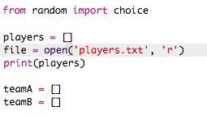

## Tiedostot

Voit tallentaa pelaajasi luettelon tiedoston avulla.

+ Napsauta + -kuvaketta ja luo uusi tiedosto nimeltä `players.txt`.
    
    

+ Lisää pelaajasi uuteen tiedostoon. Varmista, että viimeisen soittimen jälkeen ei ole tyhjää riviä.
    
    

+ Vaihda `pelaajasi` lista niin, että se on tyhjä.
    
    

+ Avaa `players.txt` tiedosto ( `'r'` tarkoittaa vain lukua).
    
    

+ Lue luettelo tiedostosta ja lisää se `pelaajaasi` luetteloon. ( `viivakoodi` koodi tarkoittaa, että jokainen rivi tiedostossa on uusi kohde `pelaajan` luettelossa).
    
    

+ Jos testat koodisi, sen pitäisi toimia täsmälleen sama kuin aiemmin. Nyt on kuitenkin paljon helpompaa lisätä pelaajia `pelaajaasi. Txt` tiedosto.