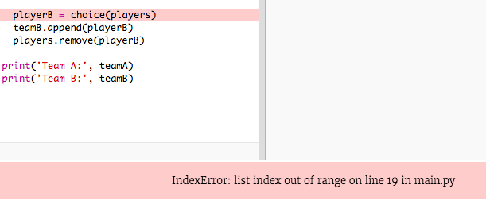

## Odd-pelaajat

Parannetaan ohjelmaa parittomien pelaajien parissa.

+ Lisää toinen nimi `soittosi.txt` -luetteloon, jotta sinulla on pariton määrä pelaajia.
    
    

+ Jos testaat koodisi, näet, että saat virheilmoituksen.
    
    

+ Virhe on se, että ohjelmasi pitää valita satunnaiset pelaajat joukkueelle A ja sitten joukkue B. Jos kuitenkin on outoa joukko pelaajia, sen jälkeen, kun hän on valinnut pelaajan joukkueelle A, ei ole jäljellä pelaajia, jotka voisivat valita joukkuetta B.
    
    Voit korjata tämän vian, voit kertoa ohjelmasi `rikkoa` ulos `ja` silmukka, jos `pelaajat` luettelo on tyhjä.
    
    

+ Jos testat koodisi uudelleen, sinun on nähtävä, että se toimii parittomalla pelaajamäärällä.
    
    