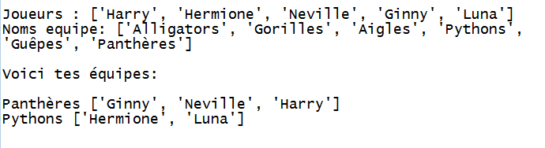

## Introduction:

Dans ce projet, tu apprendras comment créer 2 équipes aléatoires à partir d'une liste de joueurs.

  <iframe src="https://trinket.io/embed/python/ac53aa6066?outputOnly=true&start=result" width="600" height="500" frameborder="0" marginwidth="0" marginheight="0" allowfullscreen>
  </iframe>
  

### Informations complémentaires pour les responsables de club

Si vous avez besoin d'imprimer ce projet, merci d'utiliser la [Version imprimable](https://projects.raspberrypi.org/fr-FR/projects/team-chooser/print).

--- collapse ---
---
title: Notes pour le responsable de club
---
## Introduction:

Dans ce projet, les enfants apprendront comment créer un programme pour diviser une liste de joueurs en 2 équipes aléatoires. Ce projet enseigne les listes et l'utilisation de fichiers.

## Ressources en-ligne

**Ce projet utilise Python 3.** Nous recommandons l'utilisation de [Trinket](https://trinket.io/) pour écrire du code Python en-ligne. Ce projet contient les Trinkets suivants :

* [Nouveau (vide) Trinket Python -- jumpto.cc/python-new](http://jumpto.cc/python-new)

Il existe aussi ce trinket qui contient le projet complet:

* [‘Sélecteur d'équipe’ terminé -- trinket.io/python/ac53aa6066](https://trinket.io/python/ac53aa6066)

## Ressources hors-ligne

Ce projet peut être [complété hors-ligne](https://www.codeclubprojects.org/en-GB/resources/python-working-offline/) si désiré. Vous pouvez accéder aux ressources du projet en cliquant sur le lien "Matériel pour projet". Ce lien contient une section "Ressources du projet" qui inclut les ressources dont les enfants auront besoin pour compléter le projet hors-ligne. Assurez-vous que les enfants ont accès à une copie de ces ressources. Cette section inclut les fichiers suivants :

* team/team.py

Vous pouvez aussi trouver une version complétée du projet dans la section "Ressources du bénévole" qui contient :

* team-finished/team.py

(Toutes les ressources ci-dessus peuvent aussi être téléchargées dans les fichiers `.zip` projet et bénévole)

## Objectifs d'apprentissage

* Listes;
* Chargement des données de la liste depuis un fichier.

Ce projet traite des éléments suivants du [Programme Raspberry Pi de Créativité Numérique](https://rpf.io/curriculum):

* [Utiliser des constructions basiques de programmation pour élaborer un programme simple.](https://www.raspberrypi.org/curriculum/programming/creator)

## Défis

* "Ajouter plus de joueurs" - ajouter des éléments à une liste `joueurs`;
* "Choisir pour l'équipe B" - créer une nouvelle liste `équipeB` pour y ajouter des joueurs aléatoires;
* "Noms aléatoires d'équipe" - création et utilisation d'une nouvelle liste `Nomséquipe` pour assigner des noms aléatoires aux équipes;
* "Stocker les noms des équipes" - stocke les noms des équipes dans un fichier et les charge dans une variable `Nomséquipe`;
* "Plus d'équipes" - diviser les joueurs en 3 équipes au lieu de 2.

--- /collapse ---

--- collapse ---
---
title: Matériel pour le projet
---
## Ressources pour le projet

* Vous pouvez trouver le [projet terminé ici](https://rpf.io/p/en/team-chooser-go){:target="_blank"}.
* [Trinket Python en-ligne vierge](http://jumpto.cc/python-new)
* [Fichier Python hors-ligne vierge](resources/new-new.py)

## Ressources pour le responsable de club

* Vous pouvez trouver le [projet terminé ici](https://rpf.io/p/en/team-chooser-get){:target="_blank"}.
* [Trinket Python en-ligne completé](https://trinket.io/python/ac53aa6066)
* [team-chooser-finished/team-chooser.py](resources/team-chooser-finished-team-chooser.py)

--- /collapse ---