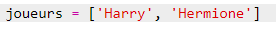
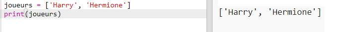

## Joueurs

Commençons par créer une liste de joueurs à choisir.

+ Ouvre le modèle de Trinket Python vierge : <a href="http://jumpto.cc/python-new" target="_blank">jumpto.cc/python-new</a>.

+ Tu peux utiliser une variable pour stocker une **liste** de joueurs. La liste doit être dans des crochets `[ ]`, avec une virgule entre chaque élément dans la liste.
    
    Commence par ajouter une liste de joueurs à ton programme.
    
    

+ Ajoute ce code pour afficher ta variable `joueurs`:
    
    

+ Tu peux accéder à un élément dans la liste en ajoutant sa position dans les crochets après le nom de la variable.
    
    Le premier élément de la liste est à la **position 0** . Ceci est différent de Scratch, qui commence à la position 1.
    
    