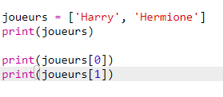

## Joueurs

Commençons par créer notre liste de joueurs.

+ Ouvre un Trinket Python vide: <a href="http://jumpto.cc/python-new" target="_blank">jumpto.cc/python-new</a>. 

+ Tu peux utiliser une variable pour enregistrer une __liste__ de joueurs. La liste doit etre déclarer entre crochets `[ ]`, avec une virgule entre chaque liste.

	Commence par jouter une liste de joueurs a ton programme.

	

+ Ajoute ce code pour afficher ta variable `players`:

	

+ Tu peux recupérer un joueur dans la liste en ajoutant sa position dans les crochets après le nom de la variable.

	Le premier objet (ou joueur) dans la liste est à la __position 0__. C'est différent dans Scratch, qui commence à la position 1.

	

