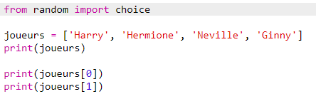
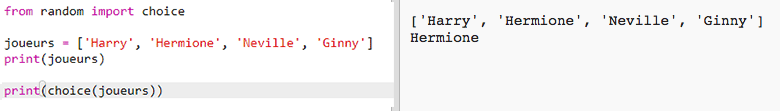
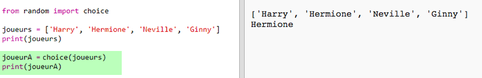
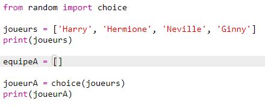
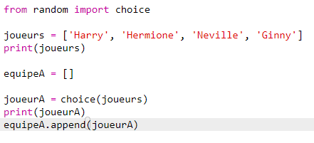
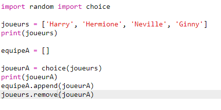
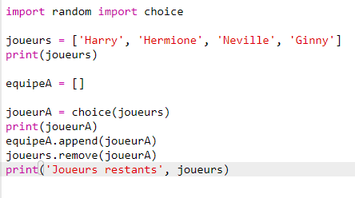

## Joueurs aléatoires

Il est temps de choisir nos joueurs aléatoires!

+ Pour récuperer un joueur aléatoire de ta liste `players`, en premier tu dois importer la function `choice` du module `random`.

	

+ Pour choisir un joueur aléatoire, tu peux maintenant utiliser `choice`. (tu peux aussi supprimer le code pour afficher des joueurs individuellement).

	

+ Test ton code `choice` plusieurs fois et tu devrais voir un joueurs différent a chaque fois.

+ Tu peux aussi créer une nouvele variable `playerA`, et l'utiliser pour enregistrer ton joueur aléatoire.

	

+ Tu vas avoir besoin d'une nouvelle liste pour enregistrer tous les joueurs de l'équipe A. Pour commencer, la liste devras etre vide.

	

+ Tu peux maintenant ajouter les joueurs choisi aléatoirement dans la liste `teamA`. Pour faire cela, tu peux utiliser la function `teamA.append` (__append__ signifie ajouter à la fin).

	

+ Maintenant que tes joueurs on été choisis, tu peux les enlever de ta liste de joueurs `players`.

	

+ Test ce code en ajoutant une commande `print`, pour afficher les joueurs `players` qu'il reste a choisir.

	

	Dans l'exemple ci-dessus, Hermione a été choisi pour `teamA`, et a donc été enlevé de la liste des joueurs `players`.
